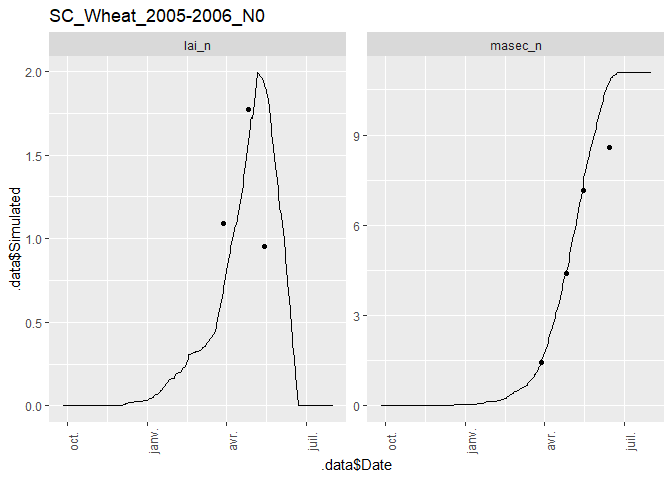

<!-- README.md is generated from README.Rmd. Please edit that file -->

# CroPlotR

<!-- badges: start -->

[](https://www.repostatus.org/#wip)
[](https://codecov.io/gh/SticsRPacks/CroPlotR?branch=master)
<!-- badges: end -->

`CroPlotR` aims at the standardization of the process of analyzing the
outputs from crop model such as
[STICS](https://www6.paca.inrae.fr/stics_eng/),
[APSIM](https://www.apsim.info/) or really any model.

> The package is under intensive development and is in a very early
> version. The functions may heavily change from one version to another
> until a more stable version is released.

## Table of Contents

  - [1. Installation](#1-installation)
  - [2. Examples](#2-examples)
      - [2.1 Dynamic plots](#21-dynamic-plots)
      - [2.2. Scatter plots](#22-scatter-plots)
      - [2.3. Group comparison](#23-group-comparison)

## 1\. Installation

You can install the released version of CroPlotR from
[Github](https://github.com/SticsRPacks/CroPlotR) either using
`devtools` or the lightweight `remotes` package:

  - With `devtools`

<!-- end list -->

``` r
devtools::install_github("SticsRPacks/CroPlotR@*release")
```

  - With `remotes`

<!-- end list -->

``` r
# install.packages("remotes")
remotes::install_github("SticsRPacks/CroPlotR@*release")
```

Normaly, all the package dependencies will be installed for CRAN
packages.

## 2\. Examples

At the moment, only one function is exported: `[plot()]`, and its alias
`[autoplot()]`. This function is the only one you need for all your
plots.

Here is an example using STICS with a simulation of three situations
(called USM in STICS) with their observations:

  - an intercrop of Wheat and pea
  - a Pea in sole crop
  - a Wheat in sole crop

Let’s import the simulation and observation data:

``` r
library(CroPlotR)

# Importing an example with three situations with observation:
workspace= system.file(file.path("extdata", "stics_example_1"), package = "CroPlotR")
situations= SticsRFiles::get_usms_list(usm_path = file.path(workspace,"usms.xml"))
sim= SticsRFiles::get_daily_results(workspace = workspace, usm_name = situations)
obs= SticsRFiles::get_obs(workspace =  workspace, usm_name = situations)
```

### 2.1 Dynamic plots

Here is an application of plotting dynamic plots:

``` r
plot(sim, obs= obs)
#> $`IC_Wheat_Pea_2005-2006_N0`
```


    #> 
    #> $`SC_Pea_2005-2006_N0`


    #> 
    #> $`SC_Wheat_2005-2006_N0`



Note that the `obs` argument is explicitely named. This is because the
first argument of the function is `...` (we’ll see why in a minute).

### 2.2 Scatter plots

Here are the same plots, but presented as scatter plots:

``` r
# Only plotting the first situation for this one:
plots= plot(sim, obs= obs, type = "scatter")
plots[[1]]
```


### 2.3 Group comparison

We can compare groups of simulations alongside by simply adding the
simulations objects one after the other (that is why the first argument
of the function is `...`). Group simulations can be the results of
simulations from different model versions, or simulations with different
parameter values.

``` r
workspace2= system.file(file.path("extdata", "stics_example_2"), package = "CroPlotR")
sim2= SticsRFiles::get_daily_results(workspace = workspace2)

plot(sim, sim2, obs= obs, type = "scatter")
#> $`IC_Wheat_Pea_2005-2006_N0`
```


Here only one plot is outputed because `workspace2` only contains the
intercrop situation.

We can also name the corresponding group in the plot by naming them
while passing to the `plot()` function:

``` r
plot("New version"= sim, original= sim2, obs= obs, type = "scatter")
#> $`IC_Wheat_Pea_2005-2006_N0`
```


