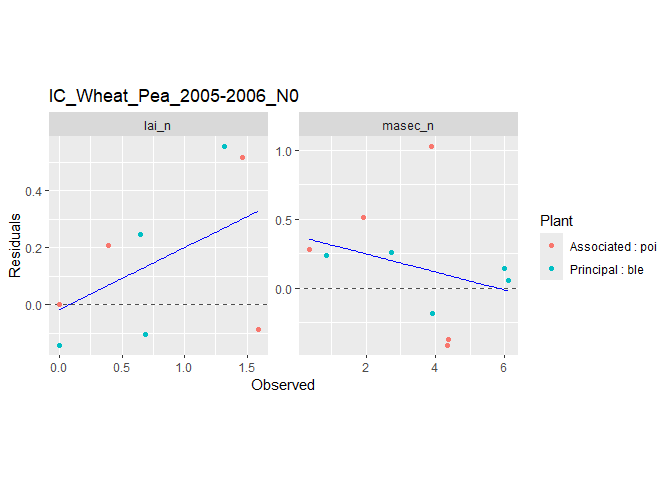
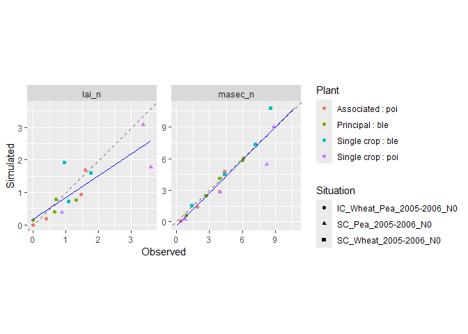
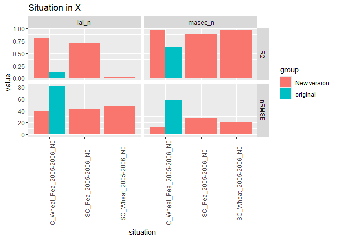

<!-- README.md is generated from README.Rmd. Please edit that file -->

# CroPlotR

<!-- badges: start -->

[](https://www.repostatus.org/#wip)
[](https://app.codecov.io/gh/SticsRPacks/CroPlotR?branch=master)
[](https://github.com/SticsRPacks/CroPlotR/actions/workflows/check-standard.yaml)
[](https://zenodo.org/badge/latestdoi/263962392)

<!-- badges: end -->

`CroPlotR` aims at the standardization of the process of analyzing the
outputs from crop models such as
[STICS](https://www6.paca.inrae.fr/stics_eng/),
[APSIM](https://www.apsim.info/) or really any model.

Its use does not need any particular adaptation if your model has been
wrapped with the [CroptimizR](https://github.com/SticsRPacks/CroptimizR)
package.

If you want to be notified when a new release of this package is made,
you can tick the Releases box in the “Watch / Unwatch =\> Custom” menu
at the top right of [this
page](https://github.com/SticsRPacks/CroPlotR).

## Table of Contents

- [1. Installation](#1-installation)
- [2. Examples](#2-examples)
  - [2.1 Plotting](#21-plotting)
    - [2.1.1 Dynamic plots](#211-dynamic-plots)
    - [2.1.2 Scatter plots](#212-scatter-plots)
    - [2.1.3 Group comparison](#213-group-comparison)
    - [2.1.4 Plot saving](#214-plot-saving)
    - [2.1.5 Plot extracting](#215-plot-extracting)
  - [2.2 Statistics](#22-statistics)
    - [2.2.1 Dynamic plots](#221-simple-case)
    - [2.2.2 Several groups](#222-several-groups)
    - [2.2.3 Statistics plot](#223-statistics-plot)
  - [2.3 Data manipulation](#23-data-manipulation)
- [3. Tools](#3-tools)
  - [3.1 ggplotly](#31-ggplotly)
  - [3.2 patchwork](#32-patchwork)
- [4. Help](#4-help)
- [5. Citation](#5-Citation)

## 1. Installation

You can install the released version of CroPlotR from
[Github](https://github.com/SticsRPacks/CroPlotR) either using
`devtools` or the lightweight `remotes` package:

- With `devtools`

``` r
devtools::install_github("SticsRPacks/CroPlotR@*release")
```

- With `remotes`

``` r
# install.packages("remotes")
remotes::install_github("SticsRPacks/CroPlotR@*release")
```

Normally, all the package dependencies will be installed for CRAN
packages.

## 2. Examples

At the moment, only one function is exported for plots
[`plot()`](https://sticsrpacks.github.io/CroPlotR/reference/plot.cropr_simulation.html)
(and its alias `autoplot()`), and one for the statistics
[`summary()`](https://sticsrpacks.github.io/CroPlotR/reference/summary.cropr_simulation.html).
These functions should be the only one you need for all your plots and
summary statistics. Additional ones are provided to simplify the
manipulation of simulated data (see [2.3 Data
manipulation](#23-data-manipulation)).

In the following, an example using the STICS crop model is presented. If
you want to use another model for which a wrapper has been designed for
the [CroptimizR](https://github.com/SticsRPacks/CroptimizR) package,
just consider defining the `sim` variable used in the examples below as
`sim <- result$sim_list`, where `result` is the list returned by your
model wrapper. Examples of use of CroPlotR with Stics and APSIM model
wrappers can be found in [CroptimizR’s
website](https://sticsrpacks.github.io/CroptimizR/) (see Articles tab).

In the following example a simulation of three situations (called USM in
STICS) with their observations is used:

- an intercrop of Wheat and pea
- a Pea in sole crop
- a Wheat in sole crop

Let’s import the simulation and observation data:

``` r
library(CroPlotR)

# Importing an example with three situations with observation:
workspace <- system.file(
  file.path("extdata", "stics_example_1"),
  package = "CroPlotR"
)

situations <- SticsRFiles::get_usms_list(
  file = file.path(workspace, "usms.xml")
)

sim <- SticsRFiles::get_sim(
  workspace = workspace,
  usms_file = file.path(workspace, "usms.xml")
)
#> mod_spIC_Wheat_Pea_2005-2006_N0.stimod_saIC_Wheat_Pea_2005-2006_N0.sti
#> mod_sSC_Pea_2005-2006_N0.sti
#> mod_sSC_Wheat_2005-2006_N0.sti

obs <- SticsRFiles::get_obs(
  workspace = workspace,
  usm = situations,
  usms_file = file.path(workspace, "usms.xml")
)
#> IC_Wheat_Pea_2005-2006_N0p.obsIC_Wheat_Pea_2005-2006_N0a.obs
#> SC_Pea_2005-2006_N0.obs
#> SC_Wheat_2005-2006_N0.obs
```

### 2.1 Plotting

#### 2.1.1 Dynamic plots

Here is an application of dynamic plots for the 3 situations:

``` r
p <- plot(sim, obs = obs)
```

Note that the `obs` argument is explicitly named. This is because the
first argument of the function is `...` (we’ll see why in a minute).

The plot function returns a named list of ggplot objects.

To plot all of them, just do

``` r
p
#> $`IC_Wheat_Pea_2005-2006_N0`
```


    #> 
    #> $`SC_Pea_2005-2006_N0`


    #> 
    #> $`SC_Wheat_2005-2006_N0`


or simply

``` r
plot(sim, obs = obs)
```

In this case, the elements of the list take the name of the situations.

``` r
names(p)
#> [1] "IC_Wheat_Pea_2005-2006_N0" "SC_Pea_2005-2006_N0"       "SC_Wheat_2005-2006_N0"
```

To plot only one of the graph, access it using its name:

``` r
p$`IC_Wheat_Pea_2005-2006_N0`
```


or index:

``` r
p[[1]]
```

It is possible to aggregate plots of multiple situations on the same
graph when situations follow one another over time. This can be done
using the `successive` parameter.

``` r
workspace <- system.file(
  file.path("extdata", "stics_example_successive"),
  package = "CroPlotR"
)

situations <- SticsRFiles::get_usms_list(
  file = file.path(workspace, "usms.xml")
)

sim_rot <- SticsRFiles::get_sim(
  workspace = workspace,
  usm = situations,
  usms_file = file.path(workspace, "usms.xml")
)
#> mod_sdemo_Wheat1.sti
#> mod_sdemo_BareSoil2.sti
#> mod_sdemo_maize3.sti

plot(
  sim_rot,
  var = c("resmes", "masec_n"),
  successive = list(list("demo_Wheat1", "demo_BareSoil2", "demo_maize3"))
)
#> $`demo_Wheat1 | demo_BareSoil2 | demo_maize3 | `
```


We can also overlay variables thanks to the “overlap” parameter with
dynamic plots.

``` r
plot(sim, obs = obs, overlap = list(list("lai_n", "masec_n")))
#> $`IC_Wheat_Pea_2005-2006_N0`
```


    #> 
    #> $`SC_Pea_2005-2006_N0`


    #> 
    #> $`SC_Wheat_2005-2006_N0`


> Note that it is not possible to scale the variables right now from the
> plot function (see
> [issue](https://github.com/SticsRPacks/CroPlotR/issues/2)). If you
> want to do so, you are encouraged to scale before the plotting
> function, and to add a second axis using
> [sec_axis](https://ggplot2.tidyverse.org/reference/sec_axis.html) on
> the resulting plot.

#### 2.1.2 Scatter plots

Here are the same plots, but presented as scatter plots:

``` r
# Only plotting the first situation for this one:
plots <- plot(sim, obs = obs, type = "scatter", all_situations = FALSE)
plots$`IC_Wheat_Pea_2005-2006_N0`
```


Residues can also be represented against observations:

``` r
# Only plotting the first situation again:
plots <- plot(
  sim,
  obs = obs,
  type = "scatter",
  select_scat = "res",
  all_situations = FALSE
)

plots[[1]]
```



All these data can also be represented with a single graph for all
situations:

``` r
plot(sim, obs = obs, type = "scatter", all_situations = TRUE)
#> $all_situations
```


When plotting residual scatter plots, `reference_var` allows to choose
the reference variable on the x-axis. Thus, the observations or
simulations of this reference variable (to be chosen by suffixing the
variable name by “\_obs” or “\_sim”) will be compared to the residuals
of each of the variables.

``` r
plot(
  sim,
  obs = obs,
  type = "scatter",
  select_scat = "res",
  all_situations = TRUE,
  reference_var = "lai_n_sim"
)
#> $all_situations
```


The points on the graphs can be shown in different shapes to
differentiate between situations when `all_situations = TRUE`. If
desired, the names of the situations can be displayed.

``` r
plot(
  sim,
  obs = obs[c(2, 3)],
  type = "scatter",
  all_situations = TRUE,
  shape_sit = "txt"
)
#> $all_situations
```


As you can see, this can quickly become unreadable depending on the
number of points and length of situation names; That is why you can
simply assign a different symbol to each situation.

``` r
plot(
  sim,
  obs = obs,
  type = "scatter",
  all_situations = TRUE,
  shape_sit = "symbol"
)
#> $all_situations
```



It is also possible to represent a group of situations with the same
symbol when, for example, clusters are identified.

``` r
plot(
  sim,
  obs = obs,
  type = "scatter",
  all_situations = TRUE,
  shape_sit = "group",
  situation_group = list(list("SC_Pea_2005-2006_N0", "SC_Wheat_2005-2006_N0"))
)
#> $all_situations
```


You can also name your `situation_group` list and thus customize (e.g
shorten) the plot legend.

``` r
plot(
  sim,
  obs = obs,
  type = "scatter",
  all_situations = TRUE,
  shape_sit = "group",
  situation_group = list(
    "Two Single Crops" = list("SC_Pea_2005-2006_N0", "SC_Wheat_2005-2006_N0")
  )
)
#> $all_situations
```


By default, all variables are returned by `plot()`, but you can filter
them using the `var` argument:

``` r
plot(sim, obs = obs, type = "scatter", all_situations = TRUE, var = c("lai_n"))
#> $all_situations
```


Error bars related to observations can also be added to the graph using
the `obs_sd` parameter which must be of the same shape as `obs`. In our
example, we will create a false data frame with the only purpose of
having a preview of the result. To have 95% confidence, the error bar is
equal to two standard deviations on each side of the point.

``` r
obs_sd <- obs
names_obs <- names(obs_sd$`SC_Pea_2005-2006_N0`)
obs_sd$`SC_Pea_2005-2006_N0`[, !(names_obs %in% c("Date", "Plant"))] <-
  0.05 * obs_sd$`SC_Pea_2005-2006_N0`[, !(names_obs %in% c("Date", "Plant"))]
obs_sd$`SC_Wheat_2005-2006_N0`[, !(names_obs %in% c("Date", "Plant"))] <-
  0.2 * obs_sd$`SC_Wheat_2005-2006_N0`[, !(names_obs %in% c("Date", "Plant"))]

plot(sim, obs = obs, obs_sd = obs_sd, type = "scatter", all_situations = TRUE)
#> $all_situations
```


#### 2.1.3 Group comparison

We can compare groups of simulations alongside by simply adding the
simulations objects one after the other (that is why the first argument
of the function is `...`). Group simulations can be the results of
simulations from different model versions, or simulations with different
parameter values.

``` r
workspace2 <- system.file(
  file.path("extdata", "stics_example_2"),
  package = "CroPlotR"
)

sim2 <- SticsRFiles::get_sim(
  workspace = workspace2,
  usms_file = file.path(workspace2, "usms.xml")
)
#> mod_spIC_Wheat_Pea_2005-2006_N0.stimod_saIC_Wheat_Pea_2005-2006_N0.sti

plot(sim, sim2, obs = obs, all_situations = FALSE)
#> $`IC_Wheat_Pea_2005-2006_N0`
```


Here only one plot is outputted because `workspace2` only contains the
intercrop situation.

We can also name the corresponding group in the plot by naming them
while passing to the `plot()` function:

``` r
plot(
  "New version" = sim,
  original = sim2,
  obs = obs,
  type = "scatter",
  all_situations = FALSE
)
#> $`IC_Wheat_Pea_2005-2006_N0`
```


#### 2.1.4 Plot saving

The plots can be saved to disk using the `save_plot_png()` function as
follows:

``` r
plots <- plot("New version" = sim, original = sim2, obs = obs, type = "scatter")

save_plot_png(plot = plots, out_dir = "path/to/directory", suffix = "_scatter")

# or by piping:
plots <- plot(
  "New version" = sim,
  original = sim2,
  obs = obs,
  type = "scatter"
) %>%
  save_plot_png(., out_dir = "path/to/directory", suffix = "_scatter")
```

They can also be saved using the `save_plot_pdf()` function that which,
from a list of ggplots, generates a pdf file. If the `file_per_var`
parameter is TRUE, in this case the function generates one pdf file per
variable.

``` r
plots <- plot(sim, obs = obs)

save_plot_pdf(plot = plots, out_dir = "path/to/directory", file_per_var = FALSE)
```

#### 2.1.5 Plot extracting

When we have plots with several variables and several situations, the
`extract_plot` function allows to keep the situations and variables that
we need.

In the following example, we want to extract the intercrop situation and
the “masec_n” variable.

``` r
plots <- plot(sim, obs = obs, type = "scatter", all_situations = FALSE)

extract_plot(
  plots,
  situation = c("IC_Wheat_Pea_2005-2006_N0"), var = c("masec_n")
)
#> $`IC_Wheat_Pea_2005-2006_N0`
```


### 2.2 Statistics

#### 2.2.1 Simple case

Here is an application of summary statistics for the 3 situations:

``` r
summary(sim, obs = obs, all_situations = FALSE)
```

    #> Attention: some observed values are zero. They are filtered for the computation of MAPE
    #> Attention: some observed values are zero. They are filtered for the computation of RME

| group | situation | variable | n_obs | mean_obs | mean_sim | r_means | sd_obs | sd_sim | CV_obs | CV_sim | R2 | SS_res | Inter | Slope | RMSE | RMSEs | RMSEu | nRMSE | rRMSE | rRMSEs | rRMSEu | pMSEs | pMSEu | Bias2 | SDSD | LCS | rbias2 | rSDSD | rLCS | MAE | FVU | MSE | EF | Bias | ABS | MAPE | RME | tSTUD | tLimit | Decision |
|:---|:---|:---|---:|---:|---:|---:|---:|---:|---:|---:|---:|---:|---:|---:|---:|---:|---:|---:|---:|---:|---:|---:|---:|---:|---:|---:|---:|---:|---:|---:|---:|---:|---:|---:|---:|---:|---:|---:|---:|:---|
| Version_1 | IC_Wheat_Pea_2005-2006_N0 | lai_n | 8 | 0.762500 | 0.6135987 | 80.47197 | 0.6326306 | 0.5508654 | 82.96794 | 89.77616 | 0.8082574 | 0.7167893 | 0.0166871 | 0.7828349 | 0.2993304 | 0.1966900 | 0.2256362 | 39.25644 | 0.3925644 | 0.2579541 | 0.2959163 | 0.4317805 | 0.5682195 | 0.0221716 | 0.0066855 | 0.0703740 | 0.0381344 | 0.0114989 | 0.1210410 | 0.2323863 | 0.1925422 | 0.0895987 | 0.7441455 | -0.1489013 | 0.2323863 | 0.3156233 | -0.2466048 | -1.5171559 | 2.364624 | OK |
| Version_1 | IC_Wheat_Pea_2005-2006_N0 | masec_n | 10 | 3.450000 | 3.2975700 | 95.58174 | 1.9615810 | 2.1296432 | 56.85742 | 64.58220 | 0.9631080 | 1.8866224 | -0.3782750 | 1.0654623 | 0.4343527 | 0.1951283 | 0.3880557 | 12.58993 | 0.1258993 | 0.0565589 | 0.1124799 | 0.2018159 | 0.7981841 | 0.0232349 | 0.0282449 | 0.1555633 | 0.0019521 | 0.0023730 | 0.0130698 | 0.3477720 | 0.0477697 | 0.1886622 | 0.9455209 | -0.1524300 | 0.3477720 | 0.1927375 | -0.1469491 | -1.1243151 | 2.262157 | OK |
| Version_1 | SC_Pea_2005-2006_N0 | lai_n | 3 | 2.622222 | 1.7386367 | 66.30394 | 1.5135732 | 1.3463799 | 57.72101 | 77.43883 | 0.6945994 | 3.7558828 | -0.2053841 | 0.7413638 | 1.1189106 | 0.9396204 | 0.6075149 | 42.67032 | 0.4267032 | 0.3583298 | 0.2316794 | 0.7052029 | 0.2947971 | 0.7807234 | 0.0279536 | 0.6789027 | 0.1135424 | 0.0040654 | 0.0987344 | 0.8835856 | 0.3085491 | 1.2519609 | 0.1802618 | -0.8835856 | 0.8835856 | 0.3901011 | -0.3901011 | -1.8203030 | 4.302653 | OK |
| Version_1 | SC_Pea_2005-2006_N0 | masec_n | 4 | 5.451667 | 4.3825425 | 80.38904 | 3.7848396 | 3.7494028 | 69.42537 | 85.55314 | 0.8907017 | 9.3636018 | -0.7144037 | 0.9349336 | 1.5300001 | 1.0901888 | 1.0734937 | 28.06481 | 0.2806481 | 0.1999735 | 0.1969111 | 0.5077156 | 0.4922844 | 1.1430265 | 0.0012558 | 1.5959095 | 0.0384590 | 0.0000423 | 0.0536970 | 1.1660625 | 0.1114949 | 2.3409005 | 0.7821153 | -1.0691242 | 1.1660625 | 0.3308096 | -0.3198354 | -1.6919332 | 3.182446 | OK |
| Version_1 | SC_Wheat_2005-2006_N0 | lai_n | 3 | 1.273333 | 1.4022867 | 110.12723 | 0.4396684 | 0.6236645 | 34.52893 | 44.47482 | 0.0098002 | 1.1058377 | 1.2234797 | 0.1404243 | 0.6071347 | 0.3344381 | 0.5067186 | 47.68074 | 0.4768074 | 0.2626477 | 0.3979465 | 0.3034319 | 0.6965681 | 0.0166290 | 0.0338546 | 0.4941208 | 0.0102561 | 0.0208801 | 0.3047537 | 0.5115933 | 2.7312604 | 0.3686126 | -1.8602948 | 0.1289533 | 0.5115933 | 0.4881989 | 0.1825306 | 0.3073876 | 4.302653 | OK |
| Version_1 | SC_Wheat_2005-2006_N0 | masec_n | 4 | 5.393750 | 6.0159025 | 111.53469 | 3.1594630 | 3.9552603 | 58.57637 | 65.74675 | 0.9637756 | 4.8187352 | -0.6129841 | 1.2289940 | 1.0975809 | 0.8829841 | 0.6519378 | 20.34912 | 0.2034912 | 0.1637050 | 0.1208691 | 0.6471914 | 0.3528086 | 0.3870737 | 0.6332935 | 0.4568533 | 0.0133049 | 0.0217682 | 0.0157035 | 0.6221525 | 0.1092090 | 1.2046838 | 0.8390892 | 0.6221525 | 0.6221525 | 0.0866369 | 0.0866369 | 1.1917478 | 3.182446 | OK |

Note that as for the `plot()` function the `obs` argument is explicitly
named. This is because the first argument of the function is `...` to be
able to compare groups (i.e. model versions or simulation with different
parameter values). In this example, a message warns the user because
some observed values have a zero value which causes a division by zero
in the calculation of certain statistical criteria, these values are
therefore filtered for the calculation of these criteria.

And as for the `plot()` function again, it is possible to compute the
statistical criteria for all situations at once.

``` r
summary(sim, obs = obs, all_situations = TRUE)
```

    #> Attention: some observed values are zero. They are filtered for the computation of MAPE
    #> Attention: some observed values are zero. They are filtered for the computation of RME

| group | situation | variable | n_obs | mean_obs | mean_sim | r_means | sd_obs | sd_sim | CV_obs | CV_sim | R2 | SS_res | Inter | Slope | RMSE | RMSEs | RMSEu | nRMSE | rRMSE | rRMSEs | rRMSEu | pMSEs | pMSEu | Bias2 | SDSD | LCS | rbias2 | rSDSD | rLCS | MAE | FVU | MSE | EF | Bias | ABS | MAPE | RME | tSTUD | tLimit | Decision |
|:---|:---|:---|---:|---:|---:|---:|---:|---:|---:|---:|---:|---:|---:|---:|---:|---:|---:|---:|---:|---:|---:|---:|---:|---:|---:|---:|---:|---:|---:|---:|---:|---:|---:|---:|---:|---:|---:|---:|---:|:---|
| Version_1 | all_situations | lai_n | 14 | 1.270476 | 1.023683 | 80.57474 | 1.085427 | 0.8698547 | 85.43465 | 84.97306 | 0.6923882 | 5.57851 | 0.1764799 | 0.6668389 | 0.6312408 | 0.4270089 | 0.4648960 | 49.68537 | 0.4968537 | 0.3361015 | 0.3659227 | 0.4575977 | 0.5424023 | 0.0609069 | 0.0464714 | 0.3170527 | 0.0377341 | 0.0287907 | 0.1964257 | 0.4317590 | 0.3085546 | 0.398465 | 0.6357717 | -0.2467933 | 0.4317590 | 0.3773867 | -0.1751950 | -1.5315489 | 2.160369 | OK |
| Version_1 | all_situations | masec_n | 18 | 4.326759 | 4.142749 | 95.74715 | 2.710052 | 2.9836105 | 62.63468 | 72.02007 | 0.8994510 | 16.06896 | -0.3749370 | 1.0441269 | 0.9448386 | 0.2176378 | 0.9194312 | 21.83710 | 0.2183710 | 0.0503004 | 0.2124988 | 0.0530583 | 0.9469417 | 0.0338598 | 0.0748344 | 0.8345469 | 0.0018087 | 0.0039974 | 0.0445785 | 0.5905878 | 0.1238200 | 0.892720 | 0.8712985 | -0.1840104 | 0.5905878 | 0.1998423 | -0.1334603 | -0.8186637 | 2.109816 | OK |

#### 2.2.2 Several groups

We can get statistics for each group of simulations by simply adding the
simulations objects one after the other (as for the `plot()` function).

``` r
summary(sim, sim2, obs = obs)
```

    #> Attention: some observed values are zero. They are filtered for the computation of MAPE
    #> Attention: some observed values are zero. They are filtered for the computation of RME
    #> Attention: some observed values are zero. They are filtered for the computation of MAPE
    #> Attention: some observed values are zero. They are filtered for the computation of RME

| group | situation | variable | n_obs | mean_obs | mean_sim | r_means | sd_obs | sd_sim | CV_obs | CV_sim | R2 | SS_res | Inter | Slope | RMSE | RMSEs | RMSEu | nRMSE | rRMSE | rRMSEs | rRMSEu | pMSEs | pMSEu | Bias2 | SDSD | LCS | rbias2 | rSDSD | rLCS | MAE | FVU | MSE | EF | Bias | ABS | MAPE | RME | tSTUD | tLimit | Decision |
|:---|:---|:---|---:|---:|---:|---:|---:|---:|---:|---:|---:|---:|---:|---:|---:|---:|---:|---:|---:|---:|---:|---:|---:|---:|---:|---:|---:|---:|---:|---:|---:|---:|---:|---:|---:|---:|---:|---:|---:|:---|
| Version_1 | all_situations | lai_n | 14 | 1.270476 | 1.0236829 | 80.57474 | 1.0854269 | 0.8698547 | 85.43465 | 84.97306 | 0.6923882 | 5.578510 | 0.1764799 | 0.6668389 | 0.6312408 | 0.4270089 | 0.4648960 | 49.68537 | 0.4968537 | 0.3361015 | 0.3659227 | 0.4575977 | 0.5424023 | 0.0609069 | 0.0464714 | 0.3170527 | 0.0377341 | 0.0287907 | 0.1964257 | 0.4317590 | 0.3085546 | 0.3984650 | 0.6357717 | -0.2467933 | 0.4317590 | 0.3773867 | -0.1751950 | -1.5315489 | 2.160369 | OK |
| Version_1 | all_situations | masec_n | 18 | 4.326759 | 4.1427489 | 95.74715 | 2.7100517 | 2.9836105 | 62.63468 | 72.02007 | 0.8994510 | 16.068959 | -0.3749370 | 1.0441269 | 0.9448386 | 0.2176378 | 0.9194312 | 21.83710 | 0.2183710 | 0.0503004 | 0.2124988 | 0.0530583 | 0.9469417 | 0.0338598 | 0.0748344 | 0.8345469 | 0.0018087 | 0.0039974 | 0.0445785 | 0.5905878 | 0.1238200 | 0.8927200 | 0.8712985 | -0.1840104 | 0.5905878 | 0.1998423 | -0.1334603 | -0.8186637 | 2.109816 | OK |
| Version_2 | all_situations | lai_n | 8 | 0.762500 | 0.5993112 | 78.59820 | 0.6326306 | 0.4383225 | 82.96794 | 73.13770 | 0.1192180 | 3.019054 | 0.4168988 | 0.2392294 | 0.6143141 | 0.4788662 | 0.3847972 | 80.56578 | 0.8056578 | 0.6280213 | 0.5046521 | 0.6076416 | 0.3923584 | 0.0266306 | 0.0377556 | 0.3631029 | 0.0458037 | 0.0649385 | 0.6245253 | 0.5046413 | 1.0015919 | 0.3773818 | -0.0776372 | -0.1631888 | 0.5046413 | 0.5726006 | -0.2460595 | -0.7290203 | 2.364624 | OK |
| Version_2 | all_situations | masec_n | 10 | 3.450000 | 3.3168750 | 96.14130 | 1.9615810 | 3.2725657 | 56.85742 | 98.66412 | 0.6237332 | 39.937521 | -1.2288238 | 1.3175938 | 1.9984374 | 0.6058240 | 1.9043974 | 57.92572 | 0.5792572 | 0.1756012 | 0.5519992 | 0.0918992 | 0.9081008 | 0.0177223 | 1.7186808 | 2.6991301 | 0.0014890 | 0.1443966 | 0.2267700 | 1.7338590 | 1.1481394 | 3.9937521 | -0.1532570 | -0.1331250 | 1.7338590 | 0.5148451 | -0.1538282 | -0.2002885 | 2.262157 | OK |

We can also name the corresponding group in the plot by naming them
while passing to the `summary()` function:

``` r
summary("New version" = sim, original = sim2, obs = obs)
```

    #> Attention: some observed values are zero. They are filtered for the computation of MAPE
    #> Attention: some observed values are zero. They are filtered for the computation of RME
    #> Attention: some observed values are zero. They are filtered for the computation of MAPE
    #> Attention: some observed values are zero. They are filtered for the computation of RME

| group | situation | variable | n_obs | mean_obs | mean_sim | r_means | sd_obs | sd_sim | CV_obs | CV_sim | R2 | SS_res | Inter | Slope | RMSE | RMSEs | RMSEu | nRMSE | rRMSE | rRMSEs | rRMSEu | pMSEs | pMSEu | Bias2 | SDSD | LCS | rbias2 | rSDSD | rLCS | MAE | FVU | MSE | EF | Bias | ABS | MAPE | RME | tSTUD | tLimit | Decision |
|:---|:---|:---|---:|---:|---:|---:|---:|---:|---:|---:|---:|---:|---:|---:|---:|---:|---:|---:|---:|---:|---:|---:|---:|---:|---:|---:|---:|---:|---:|---:|---:|---:|---:|---:|---:|---:|---:|---:|---:|:---|
| New version | all_situations | lai_n | 14 | 1.270476 | 1.0236829 | 80.57474 | 1.0854269 | 0.8698547 | 85.43465 | 84.97306 | 0.6923882 | 5.578510 | 0.1764799 | 0.6668389 | 0.6312408 | 0.4270089 | 0.4648960 | 49.68537 | 0.4968537 | 0.3361015 | 0.3659227 | 0.4575977 | 0.5424023 | 0.0609069 | 0.0464714 | 0.3170527 | 0.0377341 | 0.0287907 | 0.1964257 | 0.4317590 | 0.3085546 | 0.3984650 | 0.6357717 | -0.2467933 | 0.4317590 | 0.3773867 | -0.1751950 | -1.5315489 | 2.160369 | OK |
| New version | all_situations | masec_n | 18 | 4.326759 | 4.1427489 | 95.74715 | 2.7100517 | 2.9836105 | 62.63468 | 72.02007 | 0.8994510 | 16.068959 | -0.3749370 | 1.0441269 | 0.9448386 | 0.2176378 | 0.9194312 | 21.83710 | 0.2183710 | 0.0503004 | 0.2124988 | 0.0530583 | 0.9469417 | 0.0338598 | 0.0748344 | 0.8345469 | 0.0018087 | 0.0039974 | 0.0445785 | 0.5905878 | 0.1238200 | 0.8927200 | 0.8712985 | -0.1840104 | 0.5905878 | 0.1998423 | -0.1334603 | -0.8186637 | 2.109816 | OK |
| original | all_situations | lai_n | 8 | 0.762500 | 0.5993112 | 78.59820 | 0.6326306 | 0.4383225 | 82.96794 | 73.13770 | 0.1192180 | 3.019054 | 0.4168988 | 0.2392294 | 0.6143141 | 0.4788662 | 0.3847972 | 80.56578 | 0.8056578 | 0.6280213 | 0.5046521 | 0.6076416 | 0.3923584 | 0.0266306 | 0.0377556 | 0.3631029 | 0.0458037 | 0.0649385 | 0.6245253 | 0.5046413 | 1.0015919 | 0.3773818 | -0.0776372 | -0.1631888 | 0.5046413 | 0.5726006 | -0.2460595 | -0.7290203 | 2.364624 | OK |
| original | all_situations | masec_n | 10 | 3.450000 | 3.3168750 | 96.14130 | 1.9615810 | 3.2725657 | 56.85742 | 98.66412 | 0.6237332 | 39.937521 | -1.2288238 | 1.3175938 | 1.9984374 | 0.6058240 | 1.9043974 | 57.92572 | 0.5792572 | 0.1756012 | 0.5519992 | 0.0918992 | 0.9081008 | 0.0177223 | 1.7186808 | 2.6991301 | 0.0014890 | 0.1443966 | 0.2267700 | 1.7338590 | 1.1481394 | 3.9937521 | -0.1532570 | -0.1331250 | 1.7338590 | 0.5148451 | -0.1538282 | -0.2002885 | 2.262157 | OK |

By default, all statistics are returned by `summary`, but you can filter
them using the `stat` argument:

``` r
summary(
  "New version" = sim, original = sim2, obs = obs,
  stats = c("R2", "nRMSE")
)
```

| group       | situation      | variable |        R2 |    nRMSE |
|:------------|:---------------|:---------|----------:|---------:|
| New version | all_situations | lai_n    | 0.6923882 | 49.68537 |
| New version | all_situations | masec_n  | 0.8994510 | 21.83710 |
| original    | all_situations | lai_n    | 0.1192180 | 80.56578 |
| original    | all_situations | masec_n  | 0.6237332 | 57.92572 |

Please read the help from
[`summary.cropr_simulation()`](https://sticsrpacks.github.io/CroPlotR/reference/summary.cropr_simulation.html)
and
[`predictor_assessment()`](https://sticsrpacks.github.io/CroPlotR/reference/predictor_assessment.html).

#### 2.2.3 Statistics plot

It is also possible to plot the statistics:

In a rather obvious way, the resulting graph will take into account all
the situations simultaneously or not according to the parameter given to
`summary`. Here is an example with `all_situations = FALSE`.

``` r
stats <- summary(
  "New version" = sim,
  original = sim2,
  obs = obs,
  stats = c("R2", "nRMSE"),
  all_situations = FALSE
)
plot(stats)
```


And here is an example with `all_situations = TRUE`.

``` r
stats <- summary(
  "New version" = sim,
  original = sim2,
  obs = obs,
  stats = c("R2", "nRMSE"),
  all_situations = TRUE
)

plot(stats)
```


We can choose to plot either the group or the situation in x (and the
other is used for grouping and colouring):

``` r
stats <- summary(
  "New version" = sim,
  original = sim2,
  obs = obs,
  stats = c("R2", "nRMSE"),
  all_situations = FALSE
)

plot(stats, xvar = "situation", title = "Situation in X")
```



In the previous examples, each line corresponds to a statistical
criterion. These can also be stacked.

``` r
stats <- summary(
  "New version" = sim,
  original = sim2,
  obs = obs,
  stats = c("pMSEs", "pMSEu"),
  all_situations = FALSE
)

plot(stats, xvar = "situation", title = "Stacked columns", group_bar = "stack")
```


Or put side by side.

``` r
stats <- summary(
  "New version" = sim,
  original = sim2,
  obs = obs,
  stats = c("pMSEs", "pMSEu"),
  all_situations = FALSE
)

plot(
  stats,
  xvar = "situation",
  title = "Side-by-side columns",
  group_bar = "dodge"
)
```


To compare different versions on a single criterion, the function
produces a radar graph like the following one.

``` r
sim$`SC_Pea_2005-2006_N0`$mafruit <-
  (15 / 10) * sim$`SC_Pea_2005-2006_N0`$masec_n
sim$`SC_Wheat_2005-2006_N0`$mafruit <-
  (15 / 20) * sim$`SC_Wheat_2005-2006_N0`$masec_n
sim2$`IC_Wheat_Pea_2005-2006_N0`$mafruit <-
  sim2$`IC_Wheat_Pea_2005-2006_N0`$masec_n
obs$`IC_Wheat_Pea_2005-2006_N0`$mafruit <-
  (12 / 10) * obs$`IC_Wheat_Pea_2005-2006_N0`$masec_n
obs$`SC_Pea_2005-2006_N0`$mafruit <-
  (18 / 10) * obs$`SC_Pea_2005-2006_N0`$masec_n
obs$`SC_Wheat_2005-2006_N0`$mafruit <-
  (15 / 12) * obs$`SC_Wheat_2005-2006_N0`$masec_n

stats <- summary(
  "New version" = sim,
  original = sim2,
  obs = obs,
  stats = c("R2", "nRMSE"),
  all_situations = TRUE
)

plot(
  stats,
  type = "radar",
  crit_radar = "nRMSE",
  title = "Radar chart : nRMSE"
)
```


### 2.3 Data manipulation

Observation lists can easily be handled using e.g.
[dplyr](https://CRAN.R-project.org/package=dplyr),
[tidyr](https://CRAN.R-project.org/package=tidyr) or
[tibble](https://CRAN.R-project.org/package=tibble) packages.

The use of these packages on simulated data as returned by CroptimizR
model wrappers is sometimes prevented by their attribute
`cropr_simulation`. To easily manipulate simulated data we thus provide
two functions for (i) binding rows of data simulated on different
situations in a single data.frame or tibble and (ii) go back to the
original (cropr) format by splitting this single data.frame or tibble.

``` r
df <- bind_rows(sim)
head(df)
#>                   situation       Date lai_n masec_n Plant Dominance mafruit
#> 1 IC_Wheat_Pea_2005-2006_N0 2005-09-26     0       0   ble Principal      NA
#> 2 IC_Wheat_Pea_2005-2006_N0 2005-09-27     0       0   ble Principal      NA
#> 3 IC_Wheat_Pea_2005-2006_N0 2005-09-28     0       0   ble Principal      NA
#> 4 IC_Wheat_Pea_2005-2006_N0 2005-09-29     0       0   ble Principal      NA
#> 5 IC_Wheat_Pea_2005-2006_N0 2005-09-30     0       0   ble Principal      NA
#> 6 IC_Wheat_Pea_2005-2006_N0 2005-10-01     0       0   ble Principal      NA
```

The resulting data.frame/tibble can then easily be manipulated using
standard R packages. The column `situation` contains the name of the
corresponding situation (as given in the named list `sim`).

To go back to the original format of simulated data handled by CroPlotR,
use the `split_df2sim` function:

``` r
sim_new <- split_df2sim(df)
lapply(sim_new, head)
#> $`IC_Wheat_Pea_2005-2006_N0`
#>         Date lai_n masec_n Plant Dominance
#> 1 2005-09-26     0       0   ble Principal
#> 2 2005-09-27     0       0   ble Principal
#> 3 2005-09-28     0       0   ble Principal
#> 4 2005-09-29     0       0   ble Principal
#> 5 2005-09-30     0       0   ble Principal
#> 6 2005-10-01     0       0   ble Principal
#> 
#> $`SC_Pea_2005-2006_N0`
#>         Date lai_n masec_n Plant mafruit
#> 1 2005-09-26     0       0   poi       0
#> 2 2005-09-27     0       0   poi       0
#> 3 2005-09-28     0       0   poi       0
#> 4 2005-09-29     0       0   poi       0
#> 5 2005-09-30     0       0   poi       0
#> 6 2005-10-01     0       0   poi       0
#> 
#> $`SC_Wheat_2005-2006_N0`
#>         Date lai_n masec_n Plant mafruit
#> 1 2005-09-26     0       0   ble       0
#> 2 2005-09-27     0       0   ble       0
#> 3 2005-09-28     0       0   ble       0
#> 4 2005-09-29     0       0   ble       0
#> 5 2005-09-30     0       0   ble       0
#> 6 2005-10-01     0       0   ble       0
```

## 3. Tools

### 3.1 ggplotly

The ggplotly function in plotly library makes it very easy to create
interactive graphics from a ggplot. Do not hesitate to call it with your
plot and move your mouse over the graph to discover the features of this
function.

``` r
library(plotly)

ggplotly(plot(sim, obs = obs, type = "dynamic")[[1]])
```

### 3.2 patchwork

There is also the patchwork library that allows you to easily combine
several ggplot into one.

``` r
library(patchwork)

plot1 <- plot(sim, obs = obs, type = "scatter", var = "lai_n")[[1]]
plot2 <- plot(sim, obs = obs, var = "lai_n")[[1]]
plot3 <- plot(sim, obs = obs, type = "scatter", var = "masec_n")[[1]]
plot4 <- plot(sim, obs = obs, var = "masec_n")[[1]]

plot1 + plot2 + plot3 + plot4 + plot_layout(ncol = 2)
```


## 4. Help

You can find help for the functions directly using the name of the
function followed by the class of the object you need the method for:

- plot:

``` r
?plot.cropr_simulation

?plot.statistics
```

- statistics:

``` r
?summary.cropr_simulation
```

If you have any problem, please [fill an
issue](https://github.com/SticsRPacks/CroPlotR/issues) on Github.

## 5. Citation

If you have used this package for a study that led to a publication or
report, please cite us. You can either use the citation tool from Github
if you used the last version, or use `citation("CroPlotR")` from R
otherwise.
