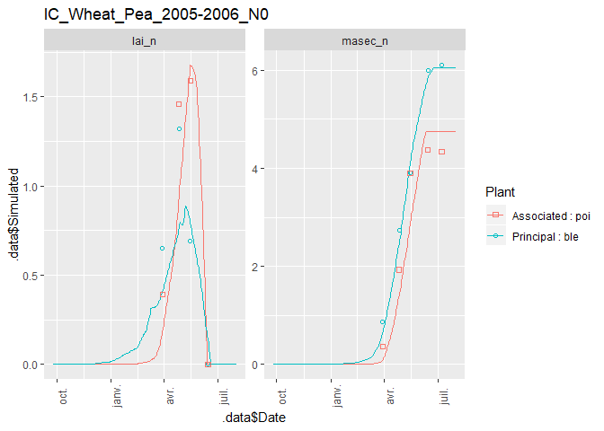
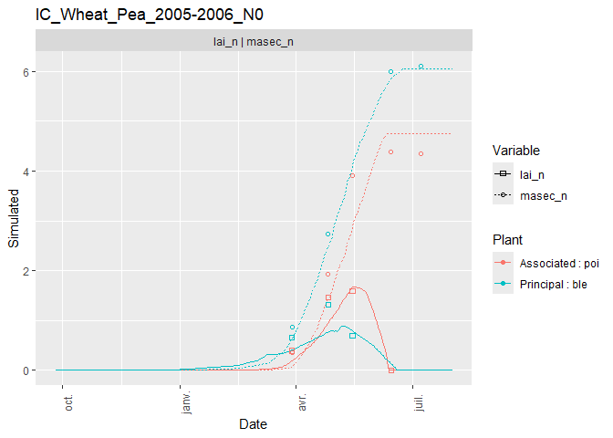
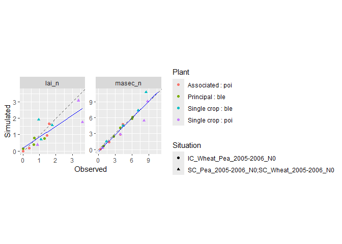
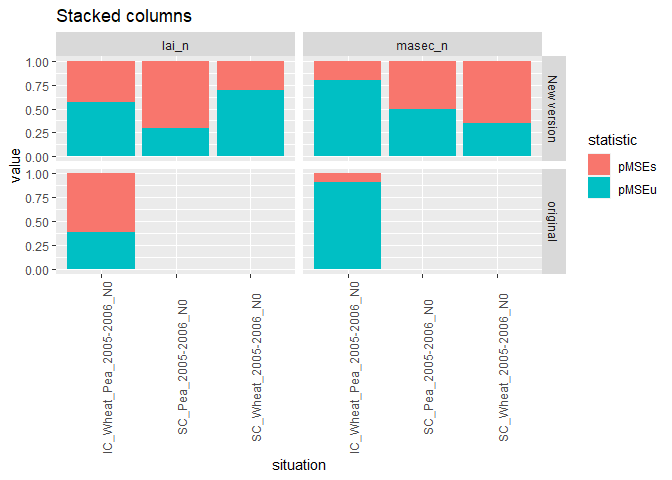

<!-- README.md is generated from README.Rmd. Please edit that file -->

# CroPlotR

<!-- badges: start -->

[](https://www.repostatus.org/#wip)
[](https://codecov.io/gh/SticsRPacks/CroPlotR?branch=master)
[](https://github.com/SticsRPacks/CroPlotR/actions)
<!-- badges: end -->

`CroPlotR` aims at the standardization of the process of analyzing the
outputs from crop model such as
[STICS](https://www6.paca.inrae.fr/stics_eng/),
[APSIM](https://www.apsim.info/) or really any model.

> The package is under intensive development and is in a very early
> version. The functions may heavily change from one version to another
> until a more stable version is released.

## Table of Contents

  - [1. Installation](#1-installation)
  - [2. Examples](#2-examples)
      - [2.1 Plotting](#21-plotting)
          - [2.1.1 Dynamic plots](#211-dynamic-plots)
          - [2.1.2 Scatter plots](#212-scatter-plots)
          - [2.1.3 Group comparison](#213-group-comparison)
          - [2.1.4 Plot saving](#214-plot-saving)
          - [2.1.5 Plot extracting](#215-plot-extracting)
      - [2.2 Statistics](#22-statistics)
          - [2.2.1 Dynamic plots](#221-simple-case)
          - [2.2.2 Several groups](#222-several-groups)
          - [2.2.3 Statistics plot](#223-statistics-plot)
      - [3. Tools](#3-tools)
          - [3.1 ggplotly](#31-ggplotly)
          - [3.2 patchwork](#32-patchwork)
      - [4. Help](#4-help)

## 1\. Installation

You can install the released version of CroPlotR from
[Github](https://github.com/SticsRPacks/CroPlotR) either using
`devtools` or the lightweight `remotes` package:

  - With `devtools`

<!-- end list -->

``` r
devtools::install_github("SticsRPacks/CroPlotR@*release")
```

  - With `remotes`

<!-- end list -->

``` r
# install.packages("remotes")
remotes::install_github("SticsRPacks/CroPlotR@*release")
```

Normally, all the package dependencies will be installed for CRAN
packages.

## 2\. Examples

At the moment, only one function is exported for plots
[`plot()`](https://sticsrpacks.github.io/CroPlotR/reference/plot.stics_simulation.html)
(and its alias `autoplot()`), and one for the statistics
[`summary()`](https://sticsrpacks.github.io/CroPlotR/reference/summary.stics_simulation.html).
These function should be the only one you need for all your plots and
summary statistics.

Here is an example using STICS with a simulation of three situations
(called USM in STICS) with their observations:

  - an intercrop of Wheat and pea
  - a Pea in sole crop
  - a Wheat in sole crop

Let’s import the simulation and observation data:

``` r
library(CroPlotR)
#> Learn CroPlotR at: https://SticsRPacks.github.io/CroPlotR

# Importing an example with three situations with observation:
workspace= system.file(file.path("extdata", "stics_example_1"), package = "CroPlotR")
situations= SticsRFiles::get_usms_list(usm_path = file.path(workspace,"usms.xml"))
sim= SticsRFiles::get_daily_results(workspace = workspace)
obs= SticsRFiles::get_obs(workspace =  workspace, usm_name = situations, usms_filename = "usms.xml")
#> [1] "IC_Wheat_Pea_2005-2006_N0p.obs" "IC_Wheat_Pea_2005-2006_N0a.obs"
#> [1] "SC_Pea_2005-2006_N0.obs"
#> [1] "SC_Wheat_2005-2006_N0.obs"
```

### 2.1 Plotting

#### 2.1.1 Dynamic plots

Here is an application of dynamic plots for the 3 situations:

``` r
plot(sim, obs= obs)
#> ! Two columns have the same name with different typographies of the variable name : qnplanteTwo columns have the same name with different typographies of the variable name : qnplante_sd
#> $`IC_Wheat_Pea_2005-2006_N0`
```



    #> 
    #> $`SC_Pea_2005-2006_N0`


    #> 
    #> $`SC_Wheat_2005-2006_N0`


Note that the `obs` argument is explicitly named. This is because the
first argument of the function is `...` (we’ll see why in a minute).

It is possible to choose the situations that we want to plot on the same
graph thanks to the `successive` parameter. This is particularly useful
when situations follow one another over time.

``` r
workspace= system.file(file.path("extdata", "stics_example_successive"), package = "CroPlotR")
situations= SticsRFiles::get_usms_list(usm_path = file.path(workspace,"usms.xml"))
sim_rot= SticsRFiles::get_daily_results(workspace = workspace, usm_name = situations)

plot(sim_rot, var = c("resmes","masec_n"), successive = list(list("demo_Wheat1","demo_BareSoil2","demo_maize3")))
#> $`demo_Wheat1 | demo_BareSoil2 | demo_maize3 | `
```


We can also overlay variables thanks to the “overlap” parameter with
dynamic plots.

``` r
plot(sim, obs= obs, overlap = list(list("lai_n","masec_n")))
#> ! Two columns have the same name with different typographies of the variable name : qnplanteTwo columns have the same name with different typographies of the variable name : qnplante_sd
#> $`IC_Wheat_Pea_2005-2006_N0`
```


    #> 
    #> $`SC_Pea_2005-2006_N0`


    #> 
    #> $`SC_Wheat_2005-2006_N0`


#### 2.1.2 Scatter plots

Here are the same plots, but presented as scatter plots:

``` r
# Only plotting the first situation for this one:
plots= plot(sim, obs= obs, type = "scatter", all_situations = FALSE)
#> ! Two columns have the same name with different typographies of the variable name : qnplanteTwo columns have the same name with different typographies of the variable name : qnplante_sd
plots[[1]]
```


Residues can also be represented against observations:

``` r
# Only plotting the first situation again:
plots= plot(sim, obs= obs, type = "scatter", select_scat = "res", all_situations = FALSE)
#> ! Two columns have the same name with different typographies of the variable name : qnplanteTwo columns have the same name with different typographies of the variable name : qnplante_sd
plots[[1]]
```


All these data can also be represented with a single graph for all
situations:

``` r
plot(sim, obs= obs, type = "scatter", all_situations = TRUE)
#> ! Two columns have the same name with different typographies of the variable name : qnplanteTwo columns have the same name with different typographies of the variable name : qnplante_sd
#> $all_situations
```


When plotting residual scatter plots, `reference_var` allows to choose
the reference variable on the x-axis. Thus, the observations or
simulations of this reference variable (to be chosen by suffixing the
variable name by "\_obs" or "\_sim") will be compared to the residuals
of each of the variables.

``` r
plot(sim, obs= obs, type = "scatter", select_scat="res", all_situations = TRUE,
     reference_var = "lai_n_sim")
#> ! Two columns have the same name with different typographies of the variable name : qnplanteTwo columns have the same name with different typographies of the variable name : qnplante_sd
#> $all_situations
```


The points on the graphs can be shown in different shapes to
differentiate between situations when `all_situations = TRUE`. If
desired, the names of the situations can be displayed.

``` r
plot(sim, obs= obs[c(2,3)], type = "scatter", all_situations = TRUE, shape_sit = "txt")
#> ! Two columns have the same name with different typographies of the variable name : qnplanteTwo columns have the same name with different typographies of the variable name : qnplante_sd
#> $all_situations
```



As you can see, this can quickly become unreadable depending on the
number of points; That is why you can simply assign a different symbol
to each situation.

``` r
plot(sim, obs= obs, type = "scatter", all_situations = TRUE, shape_sit = "symbol")
#> ! Two columns have the same name with different typographies of the variable name : qnplanteTwo columns have the same name with different typographies of the variable name : qnplante_sd
#> $all_situations
```


It is also possible to represent a group of situations with the same
symbol when, for example, clusters are identified.

``` r
plot(sim, obs= obs, type = "scatter", all_situations = TRUE, 
     shape_sit = "group", situation_group = list(list("SC_Pea_2005-2006_N0","SC_Wheat_2005-2006_N0")))
#> ! Two columns have the same name with different typographies of the variable name : qnplanteTwo columns have the same name with different typographies of the variable name : qnplante_sd
#> $all_situations
```


You can also name your `situation_group` list and thus customize (e.g
shorten) the plot legend.

``` r
plot(sim, obs= obs, type = "scatter", all_situations = TRUE, shape_sit = "group", 
     situation_group = list("Two Single Crops"=list("SC_Pea_2005-2006_N0","SC_Wheat_2005-2006_N0")))
#> ! Two columns have the same name with different typographies of the variable name : qnplanteTwo columns have the same name with different typographies of the variable name : qnplante_sd
#> $all_situations
```


By default, all variables are returned by `plot()`, but you can filter
them using the `var` argument:

``` r
plot(sim, obs= obs, type = "scatter", all_situations = TRUE, var=c("lai_n"))
#> ! Two columns have the same name with different typographies of the variable name : qnplanteTwo columns have the same name with different typographies of the variable name : qnplante_sd
#> $all_situations
```


Error bars related to observations can also be added to the graph using
the `obs_sd` parameter which must be of the same shape as `obs`. In our
example, we will create a false data frame with the only purpose of
having a preview of the result. To have 95% confidence, the error bar is
equal to two standard deviations on each side of the point.

``` r
obs_sd = obs
obs_sd$`SC_Pea_2005-2006_N0`[,-c(1,2,3,4,5,34)]= 0.05*obs_sd$`SC_Pea_2005-2006_N0`[,-c(1,2,3,4,5,34)]
obs_sd$`SC_Wheat_2005-2006_N0`[,-c(1,2,3,4,5,36)]= 0.2*obs_sd$`SC_Wheat_2005-2006_N0`[,-c(1,2,3,4,5,36)]
plot(sim, obs= obs, obs_sd= obs_sd, type = "scatter", all_situations = TRUE)
#> ! Two columns have the same name with different typographies of the variable name : qnplanteTwo columns have the same name with different typographies of the variable name : qnplante_sd
#> $all_situations
```


#### 2.1.3 Group comparison

We can compare groups of simulations alongside by simply adding the
simulations objects one after the other (that is why the first argument
of the function is `...`). Group simulations can be the results of
simulations from different model versions, or simulations with different
parameter values.

``` r
workspace2= system.file(file.path("extdata", "stics_example_2"), package = "CroPlotR")
sim2= SticsRFiles::get_daily_results(workspace = workspace2)

plot(sim, sim2, obs= obs, all_situations = FALSE)
#> $`IC_Wheat_Pea_2005-2006_N0`
```


Here only one plot is outputed because `workspace2` only contains the
intercrop situation.

We can also name the corresponding group in the plot by naming them
while passing to the `plot()` function:

``` r
plot("New version"= sim, original= sim2, obs= obs, type = "scatter", all_situations = FALSE)
#> $`IC_Wheat_Pea_2005-2006_N0`
```



#### 2.1.4 Plot saving

The plots can be saved to disk using the `plot_save()` function as
follows:

``` r
plots= plot("New version"= sim, original= sim2, obs= obs, type = "scatter")

plot_save(plot = plots, path = "path/to/directory",suffix = "_scatter")

# or by piping:
plots= plot("New version"= sim, original= sim2, obs= obs, type = "scatter")%>%
  plot_save(., path = "path/to/directory",suffix = "_scatter")
```

They can also be saved using the `save_plot()` function that which, from
a list of ggplots, generates a pdf file. If the `file_per_var` parameter
is TRUE, in this case the function generates one pdf file per variable.

``` r
plots = plot(sim, obs = obs)

save_plot(plot = plots, path = "path/to/directory", file_per_var = FALSE)
```

#### 2.1.5 Plot extracting

When we have plots with several variables and several situations, the
`extract_plot` function allows to keep the situations and variables that
we need.

In the following example, we want to extract the intercrop situation and
the “masec\_n” variable.

``` r
plots= plot(sim, obs= obs, type = "scatter", all_situations = FALSE)
#> ! Two columns have the same name with different typographies of the variable name : qnplanteTwo columns have the same name with different typographies of the variable name : qnplante_sd
extract_plot(plots,situations=c("IC_Wheat_Pea_2005-2006_N0"),var=c("masec_n"))
#> $`IC_Wheat_Pea_2005-2006_N0`
```


### 2.2 Statistics

#### 2.2.1 Simple case

Here is an application of summary statistics for the 3 situations:

``` r
summary(sim, obs= obs, all_situations = FALSE)
#> ! Two columns have the same name with different typographies of the variable name : qnplanteTwo columns have the same name with different typographies of the variable name : qnplante_sd
#> # A tibble: 6 x 41
#>   group situation variable n_obs mean_obs mean_sim r_means sd_obs sd_sim CV_obs
#>   <chr> <chr>     <chr>    <int>    <dbl>    <dbl>   <dbl>  <dbl>  <dbl>  <dbl>
#> 1 Vers~ IC_Wheat~ lai_n        8    0.762    0.614    80.5  0.633  0.551   83.0
#> 2 Vers~ IC_Wheat~ masec_n     10    3.45     3.30     95.6  1.96   2.13    56.9
#> 3 Vers~ SC_Pea_2~ lai_n        3    2.62     1.74     66.3  1.51   1.35    57.7
#> 4 Vers~ SC_Pea_2~ masec_n      4    5.45     4.38     80.4  3.78   3.75    69.4
#> 5 Vers~ SC_Wheat~ lai_n        3    1.27     1.40    110.   0.440  0.624   34.5
#> 6 Vers~ SC_Wheat~ masec_n      4    5.39     6.02    112.   3.16   3.96    58.6
#> # ... with 31 more variables: CV_sim <dbl>, R2 <dbl>, SS_res <dbl>,
#> #   Inter <dbl>, Slope <dbl>, RMSE <dbl>, RMSEs <dbl>, RMSEu <dbl>,
#> #   nRMSE <dbl>, rRMSE <dbl>, rRMSEs <dbl>, rRMSEu <dbl>, pMSEs <dbl>,
#> #   pMSEu <dbl>, Bias2 <dbl>, SDSD <dbl>, LCS <dbl>, rbias2 <dbl>, rSDSD <dbl>,
#> #   rLCS <dbl>, MAE <dbl>, FVU <dbl>, MSE <dbl>, EF <dbl>, Bias <dbl>,
#> #   ABS <dbl>, MAPE <dbl>, RME <dbl>, tSTUD <dbl>, tLimit <dbl>, Decision <chr>
```

Note that as for the `plot()` function the `obs` argument is explicitly
named. This is because the first argument of the function is `...` to be
able to compare groups (i.e. model versions or simulation with different
parameter values).

And as for the `plot()` function again, it is possible to compute the
statistical criteria for all situations at once.

``` r
summary(sim, obs= obs, all_situations = TRUE)
#> ! Two columns have the same name with different typographies of the variable name : qnplanteTwo columns have the same name with different typographies of the variable name : qnplante_sd
#> # A tibble: 2 x 41
#>   group situation variable n_obs mean_obs mean_sim r_means sd_obs sd_sim CV_obs
#>   <chr> <chr>     <chr>    <int>    <dbl>    <dbl>   <dbl>  <dbl>  <dbl>  <dbl>
#> 1 Vers~ all_situ~ lai_n       14     1.27     1.02    80.6   1.09  0.870   85.4
#> 2 Vers~ all_situ~ masec_n     18     4.33     4.14    95.7   2.71  2.98    62.6
#> # ... with 31 more variables: CV_sim <dbl>, R2 <dbl>, SS_res <dbl>,
#> #   Inter <dbl>, Slope <dbl>, RMSE <dbl>, RMSEs <dbl>, RMSEu <dbl>,
#> #   nRMSE <dbl>, rRMSE <dbl>, rRMSEs <dbl>, rRMSEu <dbl>, pMSEs <dbl>,
#> #   pMSEu <dbl>, Bias2 <dbl>, SDSD <dbl>, LCS <dbl>, rbias2 <dbl>, rSDSD <dbl>,
#> #   rLCS <dbl>, MAE <dbl>, FVU <dbl>, MSE <dbl>, EF <dbl>, Bias <dbl>,
#> #   ABS <dbl>, MAPE <dbl>, RME <dbl>, tSTUD <dbl>, tLimit <dbl>, Decision <chr>
```

#### 2.2.1 Several groups

We can get statistics for each group of simulations by simply adding the
simulations objects one after the other (as for the `plot()` function).

``` r
summary(sim, sim2, obs= obs)
#> ! Two columns have the same name with different typographies of the variable name : qnplanteTwo columns have the same name with different typographies of the variable name : qnplante_sd
#> ! Two columns have the same name with different typographies of the variable name : qnplanteTwo columns have the same name with different typographies of the variable name : qnplante_sd
#> # A tibble: 4 x 41
#>   group situation variable n_obs mean_obs mean_sim r_means sd_obs sd_sim CV_obs
#>   <chr> <chr>     <chr>    <int>    <dbl>    <dbl>   <dbl>  <dbl>  <dbl>  <dbl>
#> 1 Vers~ all_situ~ lai_n       14    1.27     1.02     80.6  1.09   0.870   85.4
#> 2 Vers~ all_situ~ masec_n     18    4.33     4.14     95.7  2.71   2.98    62.6
#> 3 Vers~ all_situ~ lai_n        8    0.762    0.599    78.6  0.633  0.438   83.0
#> 4 Vers~ all_situ~ masec_n     10    3.45     3.32     96.1  1.96   3.27    56.9
#> # ... with 31 more variables: CV_sim <dbl>, R2 <dbl>, SS_res <dbl>,
#> #   Inter <dbl>, Slope <dbl>, RMSE <dbl>, RMSEs <dbl>, RMSEu <dbl>,
#> #   nRMSE <dbl>, rRMSE <dbl>, rRMSEs <dbl>, rRMSEu <dbl>, pMSEs <dbl>,
#> #   pMSEu <dbl>, Bias2 <dbl>, SDSD <dbl>, LCS <dbl>, rbias2 <dbl>, rSDSD <dbl>,
#> #   rLCS <dbl>, MAE <dbl>, FVU <dbl>, MSE <dbl>, EF <dbl>, Bias <dbl>,
#> #   ABS <dbl>, MAPE <dbl>, RME <dbl>, tSTUD <dbl>, tLimit <dbl>, Decision <chr>
```

We can also name the corresponding group in the plot by naming them
while passing to the `summary()` function:

``` r
summary("New version"= sim, original= sim2, obs= obs)
#> ! Two columns have the same name with different typographies of the variable name : qnplanteTwo columns have the same name with different typographies of the variable name : qnplante_sd
#> ! Two columns have the same name with different typographies of the variable name : qnplanteTwo columns have the same name with different typographies of the variable name : qnplante_sd
#> # A tibble: 4 x 41
#>   group situation variable n_obs mean_obs mean_sim r_means sd_obs sd_sim CV_obs
#>   <chr> <chr>     <chr>    <int>    <dbl>    <dbl>   <dbl>  <dbl>  <dbl>  <dbl>
#> 1 New ~ all_situ~ lai_n       14    1.27     1.02     80.6  1.09   0.870   85.4
#> 2 New ~ all_situ~ masec_n     18    4.33     4.14     95.7  2.71   2.98    62.6
#> 3 orig~ all_situ~ lai_n        8    0.762    0.599    78.6  0.633  0.438   83.0
#> 4 orig~ all_situ~ masec_n     10    3.45     3.32     96.1  1.96   3.27    56.9
#> # ... with 31 more variables: CV_sim <dbl>, R2 <dbl>, SS_res <dbl>,
#> #   Inter <dbl>, Slope <dbl>, RMSE <dbl>, RMSEs <dbl>, RMSEu <dbl>,
#> #   nRMSE <dbl>, rRMSE <dbl>, rRMSEs <dbl>, rRMSEu <dbl>, pMSEs <dbl>,
#> #   pMSEu <dbl>, Bias2 <dbl>, SDSD <dbl>, LCS <dbl>, rbias2 <dbl>, rSDSD <dbl>,
#> #   rLCS <dbl>, MAE <dbl>, FVU <dbl>, MSE <dbl>, EF <dbl>, Bias <dbl>,
#> #   ABS <dbl>, MAPE <dbl>, RME <dbl>, tSTUD <dbl>, tLimit <dbl>, Decision <chr>
```

By default, all statistics are returned by `summary`, but you can filter
them using the `stat` argument:

``` r
summary("New version"= sim, original= sim2, obs= obs, stat = c("R2","nRMSE"))
#> ! Two columns have the same name with different typographies of the variable name : qnplanteTwo columns have the same name with different typographies of the variable name : qnplante_sd
#> ! Two columns have the same name with different typographies of the variable name : qnplanteTwo columns have the same name with different typographies of the variable name : qnplante_sd
#> # A tibble: 4 x 5
#>   group       situation      variable    R2 nRMSE
#>   <chr>       <chr>          <chr>    <dbl> <dbl>
#> 1 New version all_situations lai_n    0.692  49.7
#> 2 New version all_situations masec_n  0.899  21.8
#> 3 original    all_situations lai_n    0.119  80.6
#> 4 original    all_situations masec_n  0.624  57.9
```

Please read the help from the
\[`predictor_assessment()`\]((<https://sticsrpacks.github.io/CroPlotR/reference/predictor_assessment.html>)
function.

#### 2.2.3 Statistics plot

It is also possible to plot the statistics:

In a rather obvious way, the resulting graph will take into account all
the situations simultaneously or not according to the parameter given to
`summary`. Here is an example with `all_situations = FALSE`.

``` r
stats= summary("New version"= sim, original= sim2, obs= obs, stat = c("R2","nRMSE"), all_situations = FALSE)
#> ! Two columns have the same name with different typographies of the variable name : qnplanteTwo columns have the same name with different typographies of the variable name : qnplante_sd
plot(stats)
```

 And
here is an example with `all_situations = TRUE`.

``` r
stats= summary("New version"= sim, original= sim2, obs= obs, stat = c("R2","nRMSE"), all_situations = TRUE)
#> ! Two columns have the same name with different typographies of the variable name : qnplanteTwo columns have the same name with different typographies of the variable name : qnplante_sd
#> ! Two columns have the same name with different typographies of the variable name : qnplanteTwo columns have the same name with different typographies of the variable name : qnplante_sd
plot(stats)
```


We can choose to plot either the group or the situation in x (and the
other is used for grouping and colouring):

``` r
stats= summary("New version"= sim, original= sim2, obs= obs, stat = c("R2","nRMSE"), all_situations = FALSE)
#> ! Two columns have the same name with different typographies of the variable name : qnplanteTwo columns have the same name with different typographies of the variable name : qnplante_sd
plot(stats, xvar = "situation", title= "Situation in X")
```


In the previous examples, each line corresponds to a statistical
criterion. These can also be stacked.

``` r
stats= summary("New version"= sim, original= sim2, obs= obs, stat = c("pMSEs","pMSEu"), all_situations = FALSE)
#> ! Two columns have the same name with different typographies of the variable name : qnplanteTwo columns have the same name with different typographies of the variable name : qnplante_sd
plot(stats, xvar = "situation", title= "Stacked columns", group_bar = "stack")
```



Or put side by side.

``` r
stats= summary("New version"= sim, original= sim2, obs= obs, stat = c("pMSEs","pMSEu"), all_situations = FALSE)
#> ! Two columns have the same name with different typographies of the variable name : qnplanteTwo columns have the same name with different typographies of the variable name : qnplante_sd
plot(stats, xvar = "situation", title= "Side-by-side columns", group_bar = "dodge")
```

 To
compare different versions on a single criterion, the function produces
a radar graph like the following one.

``` r
sim$`SC_Pea_2005-2006_N0`$mafruit = (15/10)*sim$`SC_Pea_2005-2006_N0`$masec_n
sim$`SC_Wheat_2005-2006_N0`$mafruit = (15/20)*sim$`SC_Wheat_2005-2006_N0`$masec_n
sim2$`IC_Wheat_Pea_2005-2006_N0`$mafruit = sim2$`IC_Wheat_Pea_2005-2006_N0`$masec_n
obs$`IC_Wheat_Pea_2005-2006_N0`$mafruit = (12/10)*obs$`IC_Wheat_Pea_2005-2006_N0`$masec_n
obs$`SC_Pea_2005-2006_N0`$mafruit = (18/10)*obs$`SC_Pea_2005-2006_N0`$masec_n
obs$`SC_Wheat_2005-2006_N0`$mafruit = (15/12)*obs$`SC_Wheat_2005-2006_N0`$masec_n

stats= summary("New version"= sim, original= sim2, obs= obs, stat = c("R2","nRMSE"), all_situations = TRUE)
#> ! Two columns have the same name with different typographies of the variable name : qnplanteTwo columns have the same name with different typographies of the variable name : qnplante_sd
#> ! Two columns have the same name with different typographies of the variable name : qnplanteTwo columns have the same name with different typographies of the variable name : qnplante_sd
plot(stats, type = "radar", crit_radar = "nRMSE", title= "Radar chart : nRMSE")
```


## 3\. Tools

### 3.1 ggplotly

The ggplotly function in plotly library makes it very easy to create
interactive graphics from a ggplot. Do not hesitate to call it with your
plot and move your mouse over the graph to discover the features of this
function.

``` r
library(plotly)

ggplotly(plot(sim,obs=obs,type="dynamic")[[1]])
```

### 3.2 patchwork

There is also the patchwork library that allows you to easily combine
several ggplot into one.

``` r
library(patchwork)
#> Warning: package 'patchwork' was built under R version 4.0.2

plot1 = plot(sim, obs = obs, type="scatter", var = "lai_n")[[1]]
#> ! Two columns have the same name with different typographies of the variable name : qnplanteTwo columns have the same name with different typographies of the variable name : qnplante_sd
plot2 = plot(sim, obs = obs, var = "lai_n")[[1]]
#> ! Two columns have the same name with different typographies of the variable name : qnplanteTwo columns have the same name with different typographies of the variable name : qnplante_sd
plot3 = plot(sim, obs = obs, type="scatter", var = "masec_n")[[1]]
#> ! Two columns have the same name with different typographies of the variable name : qnplanteTwo columns have the same name with different typographies of the variable name : qnplante_sd
plot4 = plot(sim, obs = obs, var = "masec_n")[[1]]
#> ! Two columns have the same name with different typographies of the variable name : qnplanteTwo columns have the same name with different typographies of the variable name : qnplante_sd

plot1 + plot2 + plot3 + plot4 + plot_layout(ncol = 2)
```


## 4\. Help

You can find help for the functions directly using the name of the
function followed by the class of the object you need the method for:

  - plot:

<!-- end list -->

``` r
?plot.stics_simulation

?plot.statistics
```

  - statistics:

<!-- end list -->

``` r
?summary.stics_simulation
```

As soon as other models are implemented, you’ll be able to call their
plotting and statistical methods.

If you have any other problem, please [fill an
issue](https://github.com/SticsRPacks/CroPlotR/issues) on Github.
