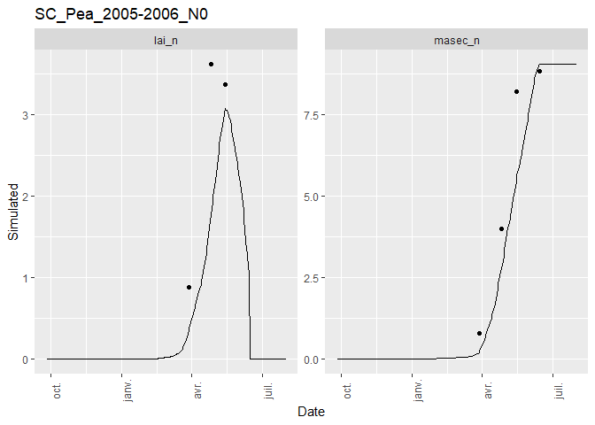
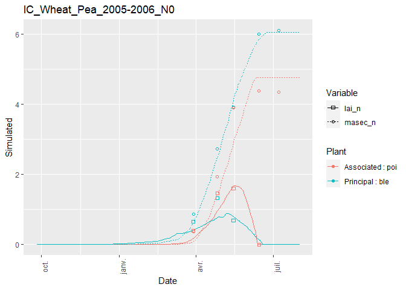
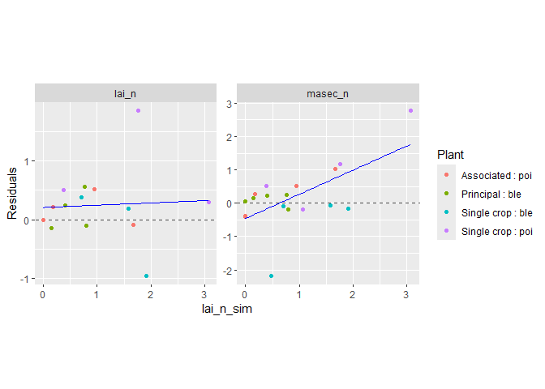
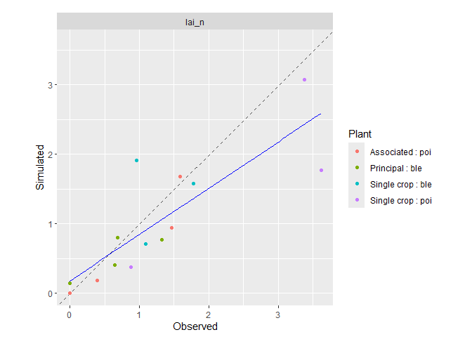
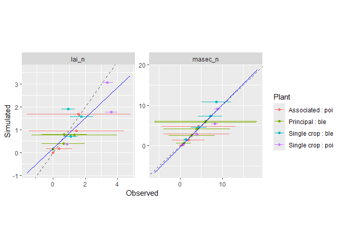
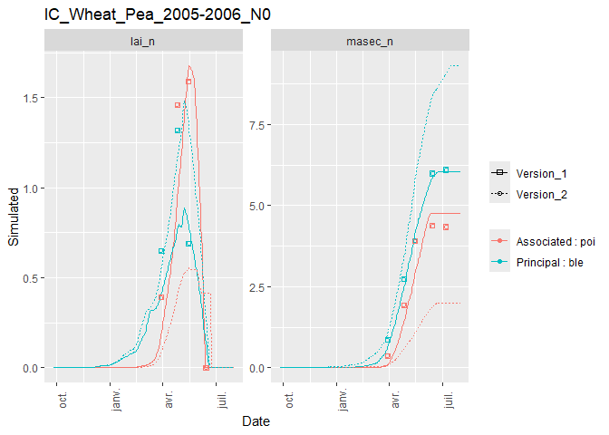

<!-- README.md is generated from README.Rmd. Please edit that file -->

# CroPlotR

<!-- badges: start -->

[](https://app.codecov.io/gh/SticsRPacks/CroPlotR?branch=main)
[](https://zenodo.org/badge/latestdoi/263962392)

<!-- badges: end -->

`CroPlotR` standardizes the analysis and visualization of crop model
outputs, including models such as
[STICS](https://www6.paca.inrae.fr/stics_eng/),
[APSIM](https://www.apsim.info/), and others.

The package works seamlessly with models wrapped using the
[CroptimizR](https://github.com/SticsRPacks/CroptimizR) package through
the `cropr_simulation` data format (see [section Data
structure](#13-data-structure)).

**Stay updated:** To receive notifications about new releases, click
“Watch” → “Custom” → “Releases” at the top of [this
repository](https://github.com/SticsRPacks/CroPlotR).

## Table of Contents

- [CroPlotR](#croplotr)
  - [Table of Contents](#table-of-contents)
  - [1. Installation](#1-installation)
  - [2. Introduction](#2-introduction)
  - [3. Dynamic plots](#3-dynamic-plots)
    - [3.1. Simple dynamic plot](#31-simple-dynamic-plot)
    - [3.2. Adding Observations](#32-adding-observations)
    - [3.3. Filtering variables](#33-filtering-variables)
    - [3.4. Successive situations](#34-successive-situations)
    - [3.5. Overlaying variables](#35-overlaying-variables)
  - [4. Scatter plots](#4-scatter-plots)
    - [4.1. Simple scatter plot](#41-simple-scatter-plot)
    - [4.2. Plotting residuals](#42-plotting-residuals)
    - [4.3. Grouping situations](#43-grouping-situations)
    - [4.4. Reference variable on the
      x-axis](#44-reference-variable-on-the-x-axis)
    - [4.5. Distinguishing Situations with
      Shapes](#45-distinguishing-situations-with-shapes)
  - [5. Comparing model versions](#5-comparing-model-versions)
  - [6. Error bars](#6-error-bars)
  - [7. Intercrops](#7-intercrops)
  - [8. Saving Plots](#8-saving-plots)
  - [9. Extracting Individual Plots](#9-extracting-individual-plots)
  - [10. Statistics](#10-statistics)
    - [10.1. Basic Usage](#101-basic-usage)
    - [10.2. Comparing Multiple Groups](#102-comparing-multiple-groups)
    - [10.3. Visualizing Statistics](#103-visualizing-statistics)
  - [11. Data manipulation](#11-data-manipulation)
  - [12. Integration with Other
    Packages](#12-integration-with-other-packages)
    - [12.1. Interactive Plots with
      plotly](#121-interactive-plots-with-plotly)
    - [12.2. Combining plots with
      patchwork](#122-combining-plots-with-patchwork)
  - [13. Data structure](#13-data-structure)
  - [14. Getting help](#14-getting-help)
  - [15. Citation](#15-citation)

## 1. Installation

Install the latest release from
[GitHub](https://github.com/SticsRPacks/CroPlotR) using either
`devtools` or `remotes`:

**Using `remotes` (recommended):**

``` r
# install.packages("remotes")
remotes::install_github("SticsRPacks/CroPlotR@*release")
```

**Using `devtools`:**

``` r
devtools::install_github("SticsRPacks/CroPlotR@*release")
```

## 2. Introduction

### Core Functions

CroPlotR provides two main functions:

- **[`plot()`](https://sticsrpacks.github.io/CroPlotR/reference/plot.cropr_simulation.html)**
  (alias: `autoplot()`) for creating visualizations
- **[`summary()`](https://sticsrpacks.github.io/CroPlotR/reference/summary.cropr_simulation.html)**
  for computing statistical metrics

These functions cover most visualization and analysis needs. Additional
helper functions are available for data manipulation (see [section Data
manipulation](#11-data-manipulation)).

### Using CroPlotR with Model Wrappers

If you’re using a model wrapper from the
[CroptimizR](https://github.com/SticsRPacks/CroptimizR) package, you can
simply extract the simulations with: `sim <- result$sim_list`, where
`result` is the object returned by the model wrapper. For detailed
examples with STICS and APSIM, visit [CroptimizR’s
documentation](https://sticsrpacks.github.io/CroptimizR/) (Articles
tab).

### Example Data

The following examples use simulation and observation data from the
STICS crop model:

**Sole crops** (objects `sim` and `obs`):

- Pea in sole crop (situation: `SC_Pea_2005-2006_N0`)
- Wheat in sole crop (situation: `SC_Wheat_2005-2006_N0`)

**Intercrop** (`sim_intercrop` and `obs_intercrop`):

- Wheat and Pea intercrop (situation: `IC_Wheat_Pea_2005-2006_N0`)

<details>
<summary>
Click to view code for loading example data
</summary>

``` r
library(CroPlotR)
#> Registered S3 method overwritten by 'CroPlotR':
#>   method             from       
#>   [.cropr_simulation SticsRFiles
#> Learn CroPlotR at: https://SticsRPacks.github.io/CroPlotR
#> 
#> Please cite CroPlotR in your work:
#> Vezy R, Buis S, Midingoyi C, Lecharpentier P, Giner M (2025).
#> CroPlotR: A Package to Analyze Crop Model Simulations Outputs with
#> Plots and Statistics. R package version 0.11.0,
#> https://doi.org/10.5281/zenodo.4442330,
#> <https://github.com/SticsRPacks/CroPlotR>.
rdata_path <- system.file(file.path("extdata", "readme_sim_obs_example.RData"), package = "CroPlotR")
load(rdata_path)
```

</details>

## 3. Dynamic Plots

Dynamic plots show variable values over time, making them ideal for
visualizing temporal patterns in crop model outputs.

### 3.1. Simple Dynamic Plot

Create basic time-series plots for all variables and situations
simulated (in this example, three variables, `lai_n`, `masec_n` and
`mafruit`, and two situations, `SC_Pea_2005-2006_N0` and
`SC_Wheat_2005-2006_N0`):

``` r
plot(sim)
#> $`SC_Pea_2005-2006_N0`
```


    #> 
    #> $`SC_Wheat_2005-2006_N0`



### 3.2. Adding Observations

Overlay observed data on simulated outputs using the `obs` argument:

``` r
plots <- plot(sim, obs = obs)
# Only displaying the first situation for this one:
plots[[1]]
```



> **Note:** The `obs` argument must be explicitly named.

### 3.3. Filtering Variables

By default, all variables are plotted. Use `var` to select specific
variables:

``` r
plots <- plot(sim, obs = obs, var = c("lai_n"))
# Only displaying the first situation for this one:
plots[[1]]
```


### 3.4. Successive Situations

Combine multiple sequential situations (e.g., crop rotations) into a
single continuous timeline using the `successive` parameter:

``` r
plot(
  sim_rot,
  var = c("resmes", "masec_n"),
  successive = list(list("demo_Wheat1", "demo_BareSoil2", "demo_maize3"))
)
#> $`demo_Wheat1 | demo_BareSoil2 | demo_maize3 | `
```


### 3.5. Overlaying Variables

Plot multiple variables on the same graph using the `overlap` parameter:

``` r
plots <- plot(sim, obs = obs, overlap = list(list("lai_n", "masec_n")))
# Only displaying the first situation for this one:
plots[[1]]
```


> **Note:** Automatic variable scaling is not yet available ([see
> issue](https://github.com/SticsRPacks/CroPlotR/issues/2)). To scale
> variables, transform your data before plotting and add a secondary
> axis using
> [`sec_axis()`](https://ggplot2.tidyverse.org/reference/sec_axis.html).

## 4. Scatter Plots

Scatter plots compare simulated versus observed values, providing visual
assessment of model performance.

### 4.1. Simple Scatter Plot

Create observed vs. simulated scatter plots by setting
`type = "scatter"`:

``` r
plots <- plot(sim, obs = obs, type = "scatter", all_situations = FALSE)
# Only displaying the first situation for this one:
plots[[1]]
```


### 4.2. Plotting Residuals

Visualize model residuals (observed - simulated values) using
`select_scat = "res"`:

``` r
plots <- plot(
  sim,
  obs = obs,
  type = "scatter",
  select_scat = "res",
  all_situations = FALSE
)
# Only displaying the first situation again, but this time using its name:
plots$`SC_Pea_2005-2006_N0`
```


### 4.3. Grouping Situations

Combine data from all situations in a single plot using
`all_situations = TRUE`:

``` r
plot(sim, obs = obs, type = "scatter", all_situations = TRUE)
#> $all_situations
```


### 4.4. Reference Variable on the X-axis

Use `reference_var` to specify which variable appears on the x-axis.
Suffix the variable name with `_obs`, `_sim` or `_res` to choose
observed, simulated or residual values:

``` r
plot(
  sim,
  obs = obs,
  type = "scatter",
  select_scat = "res",
  all_situations = TRUE,
  reference_var = "lai_n_sim"
)
#> $all_situations
```


### 4.5. Distinguishing Situations with Shapes

When plotting multiple situations together (`all_situations = TRUE`),
differentiate them using the `shape_sit` parameter.

**Display situation names as text labels:**

``` r
plot(
  sim,
  obs = obs,
  type = "scatter",
  all_situations = TRUE,
  shape_sit = "txt"
)
#> $all_situations
```


Text labels can become cluttered with many data points. Use distinct
symbols instead:

``` r
plot(
  sim,
  obs = obs,
  type = "scatter",
  all_situations = TRUE,
  shape_sit = "symbol"
)
#> $all_situations
```



**Group multiple situations under a single symbol** (e.g., for
identified clusters):

``` r
plot(
  sim,
  obs = obs,
  type = "scatter",
  all_situations = TRUE,
  shape_sit = "group",
  situation_group = list(list("SC_Pea_2005-2006_N0", "SC_Wheat_2005-2006_N0"))
)
#> $all_situations
```


**Customize legend labels** by naming your `situation_group` list:

``` r
plot(
  sim,
  obs = obs,
  type = "scatter",
  all_situations = TRUE,
  shape_sit = "group",
  situation_group = list(
    "Two Single Crops" = list("SC_Pea_2005-2006_N0", "SC_Wheat_2005-2006_N0")
  )
)
#> $all_situations
```


## 5. Comparing Model Versions

Compare different model versions or parameter sets by passing multiple
simulation objects to `plot()`. This is why the `obs` argument must be
explicitly named.

### Dynamic Plot Comparison

``` r
plots <- plot(sim, sim2, obs = obs, all_situations = FALSE)
# Only displaying the first situation for this one:
plots[[1]]
```


### Naming Model Versions

Provide descriptive names for each simulation group:

``` r
plots <- plot(
  original = sim,
  "New version" = sim2,
  obs = obs
)
# Only displaying the first situation for this one:
plots[[1]]
```


### Scatter Plot Comparison

Model versions can also be compared using scatter plots:

``` r
plots <- plot(
  original = sim,
  "New version" = sim2,
  obs = obs,
  type = "scatter",
  all_situations = FALSE
)
# Only displaying the first situation for this one:
plots[[1]]
```



## 6. Error Bars

Add uncertainty estimates to observations using the `obs_sd` parameter,
which must have the same structure as `obs`. Error bars are then
displayed as ±2 standard deviations, corresponding to an approximate 95%
confidence interval under the assumption of Gaussian observation errors.

``` r
plot(sim, obs = obs, obs_sd = obs_sd, type = "scatter", all_situations = TRUE)
#> $all_situations
```



## 7. Intercrops

CroPlotR automatically handles simulations of intercrop situations where
multiple plant species are grown together.

### Dynamic Plots for Intercrops

``` r
plot(sim_intercrop, obs = obs_intercrop)
#> $`IC_Wheat_Pea_2005-2006_N0`
```



### Scatter Plots for Intercrops

``` r
plot(sim_intercrop, obs = obs_intercrop, type = "scatter", all_situations = TRUE)
#> $all_situations
```


## 8. Saving Plots

### Save as PNG

Export individual plots as PNG files using `save_plot_png()`:

``` r
plots <- plot("New version" = sim, original = sim2, obs = obs, type = "scatter")

save_plot_png(plot = plots, out_dir = "path/to/directory", suffix = "_scatter")

# or by piping:
plots <- plot(
  "New version" = sim,
  original = sim2,
  obs = obs,
  type = "scatter"
) %>%
  save_plot_png(., out_dir = "path/to/directory", suffix = "_scatter")
```

### Save as PDF

Export plots to PDF using `save_plot_pdf()`. Set `file_per_var = TRUE`
to create separate PDFs for each variable:

``` r
plots <- plot(sim, obs = obs)

save_plot_pdf(plot = plots, out_dir = "path/to/directory", file_per_var = FALSE)
```

## 9. Extracting Individual Plots

The `plot()` function returns a named list of ggplot objects, where
names correspond to situations:

``` r
p <- plot(sim)

names(p)
#> [1] "SC_Pea_2005-2006_N0"   "SC_Wheat_2005-2006_N0"
```

### Access by Name

Access individual plots using their situation name (use backticks if the
name contains special characters):

``` r
p$`SC_Wheat_2005-2006_N0`
```


### Access by Index

Alternatively, use numeric indexing:

``` r
p[[1]]
```

### Filtering Plots

Use `extract_plot()` to filter plots by situation and/or variable. This
is useful when working with many situations and variables.

Example: Extract only the wheat situation and the `masec_n` variable:

``` r
plots <- plot(sim, obs = obs, type = "scatter", all_situations = FALSE)

extract_plot(
  plots,
  situation = c("SC_Wheat_2005-2006_N0"), var = c("masec_n")
)
#> $`SC_Wheat_2005-2006_N0`
```


## 10. Statistics

Compute performance metrics to quantitatively compare simulated and
observed values.

### 10.1. Basic Usage

Calculate statistics for each situation individually:

``` r
summary(sim, obs = obs, all_situations = FALSE)
```

| group | situation | variable | n_obs | mean_obs | mean_sim | r_means | sd_obs | sd_sim | CV_obs | CV_sim | R2 | SS_res | Inter | Slope | RMSE | RMSEs | RMSEu | nRMSE | rRMSE | rRMSEs | rRMSEu | pMSEs | pMSEu | Bias2 | SDSD | LCS | rbias2 | rSDSD | rLCS | MAE | FVU | MSE | EF | Bias | ABS | MAPE | RME | tSTUD | tLimit | Decision |
|:---|:---|:---|---:|---:|---:|---:|---:|---:|---:|---:|---:|---:|---:|---:|---:|---:|---:|---:|---:|---:|---:|---:|---:|---:|---:|---:|---:|---:|---:|---:|---:|---:|---:|---:|---:|---:|---:|---:|---:|:---|
| Version_1 | SC_Pea_2005-2006_N0 | lai_n | 3 | 2.622222 | 1.738637 | 66.30394 | 1.5135732 | 1.3463799 | 57.72101 | 77.43883 | 0.6945994 | 3.7558828 | -0.2053841 | 0.7413638 | 1.1189106 | 0.9396204 | 0.6075149 | 42.670319 | 0.4267032 | 0.3583298 | 0.2316794 | 0.7052029 | 0.2947971 | 0.7807234 | 0.0279536 | 0.6789027 | 0.1135424 | 0.0040654 | 0.0987344 | 0.8835856 | 0.3085491 | 1.2519609 | 0.1802618 | -0.8835856 | 0.8835856 | 0.3901011 | -0.3901011 | -1.8203030 | 4.302653 | OK |
| Version_1 | SC_Pea_2005-2006_N0 | mafruit | 1 | 4.355000 | 4.742713 | 108.90270 | NA | NA | NA | NA | 0.0000000 | 0.1503211 | 4.7427127 | NA | 0.3877127 | 0.3877127 | 0.0000000 | 8.902703 | 0.0890270 | 0.0890270 | 0.0000000 | 1.0000000 | 0.0000000 | 0.1503211 | NA | NA | 0.0079258 | NA | NA | 0.3877127 | NA | 0.1503211 | -Inf | 0.3877127 | 0.3877127 | 0.0890270 | 0.0890270 | NA | NaN | Insufficient size |
| Version_1 | SC_Pea_2005-2006_N0 | masec_n | 4 | 5.451667 | 4.382542 | 80.38904 | 3.7848396 | 3.7494028 | 69.42537 | 85.55314 | 0.8907017 | 9.3636018 | -0.7144037 | 0.9349336 | 1.5300001 | 1.0901888 | 1.0734937 | 28.064815 | 0.2806481 | 0.1999735 | 0.1969111 | 0.5077156 | 0.4922844 | 1.1430265 | 0.0012558 | 1.5959095 | 0.0384590 | 0.0000423 | 0.0536970 | 1.1660625 | 0.1114949 | 2.3409005 | 0.7821153 | -1.0691242 | 1.1660625 | 0.3308096 | -0.3198354 | -1.6919332 | 3.182446 | OK |
| Version_1 | SC_Wheat_2005-2006_N0 | lai_n | 3 | 1.273333 | 1.402287 | 110.12723 | 0.4396684 | 0.6236645 | 34.52893 | 44.47482 | 0.0098002 | 1.1058377 | 1.2234797 | 0.1404243 | 0.6071347 | 0.3344381 | 0.5067186 | 47.680736 | 0.4768074 | 0.2626477 | 0.3979465 | 0.3034319 | 0.6965681 | 0.0166290 | 0.0338546 | 0.4941208 | 0.0102561 | 0.0208801 | 0.3047537 | 0.5115933 | 2.7312604 | 0.3686126 | -1.8602948 | 0.1289533 | 0.5115933 | 0.4881989 | 0.1825306 | 0.3073876 | 4.302653 | OK |
| Version_1 | SC_Wheat_2005-2006_N0 | mafruit | 1 | 3.825000 | 5.675395 | 148.37634 | NA | NA | NA | NA | 0.0000000 | 3.4239617 | 5.6753950 | NA | 1.8503950 | 1.8503950 | 0.0000000 | 48.376340 | 0.4837634 | 0.4837634 | 0.0000000 | 1.0000000 | 0.0000000 | 3.4239617 | NA | NA | 0.2340270 | NA | NA | 1.8503950 | NA | 3.4239617 | -Inf | 1.8503950 | 1.8503950 | 0.4837634 | 0.4837634 | NA | NaN | Insufficient size |
| Version_1 | SC_Wheat_2005-2006_N0 | masec_n | 4 | 5.393750 | 6.015903 | 111.53469 | 3.1594630 | 3.9552603 | 58.57637 | 65.74675 | 0.9637756 | 4.8187352 | -0.6129841 | 1.2289940 | 1.0975809 | 0.8829841 | 0.6519378 | 20.349124 | 0.2034912 | 0.1637050 | 0.1208691 | 0.6471914 | 0.3528086 | 0.3870737 | 0.6332935 | 0.4568533 | 0.0133049 | 0.0217682 | 0.0157035 | 0.6221525 | 0.1092090 | 1.2046838 | 0.8390892 | 0.6221525 | 0.6221525 | 0.0866369 | 0.0866369 | 1.1917478 | 3.182446 | OK |

> **Note:** The `obs` argument must be explicitly named (same reason as
> for `plot()`).

### Aggregated Statistics

Compute statistics across all situations simultaneously:

``` r
summary(sim, obs = obs, all_situations = TRUE)
```

| group | situation | variable | n_obs | mean_obs | mean_sim | r_means | sd_obs | sd_sim | CV_obs | CV_sim | R2 | SS_res | Inter | Slope | RMSE | RMSEs | RMSEu | nRMSE | rRMSE | rRMSEs | rRMSEu | pMSEs | pMSEu | Bias2 | SDSD | LCS | rbias2 | rSDSD | rLCS | MAE | FVU | MSE | EF | Bias | ABS | MAPE | RME | tSTUD | tLimit | Decision |
|:---|:---|:---|---:|---:|---:|---:|---:|---:|---:|---:|---:|---:|---:|---:|---:|---:|---:|---:|---:|---:|---:|---:|---:|---:|---:|---:|---:|---:|---:|---:|---:|---:|---:|---:|---:|---:|---:|---:|---:|:---|
| Version_1 | all_situations | lai_n | 6 | 1.947778 | 1.570462 | 80.62838 | 1.2407801 | 0.9563566 | 63.702343 | 60.89653 | 0.4849226 | 4.861720 | 0.5250179 | 0.5367367 | 0.9001593 | 0.6463004 | 0.6265641 | 46.21468 | 0.4621468 | 0.3318142 | 0.3216815 | 0.5155017 | 0.4844983 | 0.1423674 | 0.0808967 | 0.7206064 | 0.0375260 | 0.0213232 | 0.1899413 | 0.6975894 | 0.5206137 | 0.8102867 | 0.3684171 | -0.3773161 | 0.6975894 | 0.4391500 | -0.1037853 | -1.0323533 | 2.570582 | OK |
| Version_1 | all_situations | mafruit | 2 | 4.090000 | 5.209054 | 127.36073 | 0.3747666 | 0.6595060 | 9.162997 | 12.66076 | 1.0000000 | 3.574283 | 12.4065456 | -1.7597779 | 1.3368401 | 1.3368401 | 0.0000000 | 32.68558 | 0.3268558 | 0.3268558 | 0.0000000 | 1.0000000 | 0.0000000 | 1.2522815 | 0.0810765 | 0.9886432 | 0.0748610 | 0.0048467 | 0.0591007 | 1.1190538 | 7.6163742 | 1.7871414 | -24.4487917 | 1.1190538 | 1.1190538 | 0.2863952 | 0.2863952 | 1.5301393 | 12.706205 | OK |
| Version_1 | all_situations | masec_n | 8 | 5.422708 | 5.199223 | 95.87870 | 3.2277449 | 3.6731078 | 59.522746 | 70.64725 | 0.8562305 | 14.182337 | -0.5109084 | 1.0530035 | 1.3314624 | 0.2748750 | 1.3027800 | 24.55346 | 0.2455346 | 0.0506896 | 0.2402453 | 0.0426199 | 0.9573801 | 0.0499459 | 0.1983481 | 1.7706190 | 0.0016985 | 0.0067452 | 0.0602133 | 0.8941075 | 0.1889905 | 1.7727921 | 0.8055306 | -0.2234858 | 0.8941075 | 0.2087232 | -0.1165992 | -0.4504803 | 2.364624 | OK |

### 10.2. Comparing Multiple Groups

Compute statistics for multiple simulation groups (e.g., different model
versions or parameter sets):

``` r
summary(sim, sim2, obs = obs)
```

| group | situation | variable | n_obs | mean_obs | mean_sim | r_means | sd_obs | sd_sim | CV_obs | CV_sim | R2 | SS_res | Inter | Slope | RMSE | RMSEs | RMSEu | nRMSE | rRMSE | rRMSEs | rRMSEu | pMSEs | pMSEu | Bias2 | SDSD | LCS | rbias2 | rSDSD | rLCS | MAE | FVU | MSE | EF | Bias | ABS | MAPE | RME | tSTUD | tLimit | Decision |
|:---|:---|:---|---:|---:|---:|---:|---:|---:|---:|---:|---:|---:|---:|---:|---:|---:|---:|---:|---:|---:|---:|---:|---:|---:|---:|---:|---:|---:|---:|---:|---:|---:|---:|---:|---:|---:|---:|---:|---:|:---|
| Version_1 | all_situations | lai_n | 6 | 1.947778 | 1.570462 | 80.62838 | 1.2407801 | 0.9563566 | 63.702343 | 60.89653 | 0.4849226 | 4.861720 | 0.5250179 | 0.5367367 | 0.9001593 | 0.6463004 | 0.6265641 | 46.21468 | 0.4621468 | 0.3318142 | 0.3216815 | 0.5155017 | 0.4844983 | 0.1423674 | 0.0808967 | 0.7206064 | 0.0375260 | 0.0213232 | 0.1899413 | 0.6975894 | 0.5206137 | 0.8102867 | 0.3684171 | -0.3773161 | 0.6975894 | 0.4391500 | -0.1037853 | -1.0323533 | 2.570582 | OK |
| Version_1 | all_situations | mafruit | 2 | 4.090000 | 5.209054 | 127.36073 | 0.3747666 | 0.6595060 | 9.162997 | 12.66076 | 1.0000000 | 3.574283 | 12.4065456 | -1.7597779 | 1.3368401 | 1.3368401 | 0.0000000 | 32.68558 | 0.3268558 | 0.3268558 | 0.0000000 | 1.0000000 | 0.0000000 | 1.2522815 | 0.0810765 | 0.9886432 | 0.0748610 | 0.0048467 | 0.0591007 | 1.1190538 | 7.6163742 | 1.7871414 | -24.4487917 | 1.1190538 | 1.1190538 | 0.2863952 | 0.2863952 | 1.5301393 | 12.706205 | OK |
| Version_1 | all_situations | masec_n | 8 | 5.422708 | 5.199223 | 95.87870 | 3.2277449 | 3.6731078 | 59.522746 | 70.64725 | 0.8562305 | 14.182337 | -0.5109084 | 1.0530035 | 1.3314624 | 0.2748750 | 1.3027800 | 24.55346 | 0.2455346 | 0.0506896 | 0.2402453 | 0.0426199 | 0.9573801 | 0.0499459 | 0.1983481 | 1.7706190 | 0.0016985 | 0.0067452 | 0.0602133 | 0.8941075 | 0.1889905 | 1.7727921 | 0.8055306 | -0.2234858 | 0.8941075 | 0.2087232 | -0.1165992 | -0.4504803 | 2.364624 | OK |
| Version_2 | all_situations | lai_n | 6 | 1.947778 | 1.727508 | 88.69122 | 1.2407801 | 1.0519922 | 63.702343 | 60.89653 | 0.4849226 | 4.432653 | 0.5775197 | 0.5904103 | 0.8595205 | 0.5135666 | 0.6892205 | 44.12826 | 0.4412826 | 0.2636679 | 0.3538496 | 0.3570105 | 0.6429895 | 0.0485188 | 0.0356408 | 0.7926671 | 0.0127889 | 0.0093944 | 0.2089354 | 0.6060845 | 0.5380247 | 0.7387754 | 0.4241570 | -0.2202699 | 0.6060845 | 0.4168965 | -0.0141638 | -0.5928365 | 2.570582 | OK |
| Version_2 | all_situations | mafruit | 2 | 4.090000 | 5.729959 | 140.09680 | 0.3747666 | 0.7254566 | 9.162997 | 12.66076 | 1.0000000 | 6.589424 | 13.6472001 | -1.9357557 | 1.8151341 | 1.8151341 | 0.0000000 | 44.37981 | 0.4437981 | 0.4437981 | 0.0000000 | 1.0000000 | 0.0000000 | 2.6894663 | 0.1229835 | 1.0875076 | 0.1607754 | 0.0073519 | 0.0650108 | 1.6399592 | 8.6186616 | 3.2947118 | -45.9165084 | 1.6399592 | 1.6399592 | 0.4150347 | 0.4150347 | 2.1079838 | 12.706205 | OK |
| Version_2 | all_situations | masec_n | 8 | 5.422708 | 5.719145 | 105.46658 | 3.2277449 | 4.0404186 | 59.522746 | 70.64725 | 0.8562305 | 18.959832 | -0.5619992 | 1.1583039 | 1.5394736 | 0.5624266 | 1.4330581 | 28.38939 | 0.2838939 | 0.1037169 | 0.2642698 | 0.1334711 | 0.8665289 | 0.0878745 | 0.6604385 | 1.9476809 | 0.0029883 | 0.0224595 | 0.0662347 | 1.2014558 | 0.2503393 | 2.3699790 | 0.7400211 | 0.2964364 | 1.2014558 | 0.2545956 | -0.0282592 | 0.5191739 | 2.364624 | OK |

Provide descriptive names for clarity:

``` r
summary("New version" = sim, original = sim2, obs = obs)
```

| group | situation | variable | n_obs | mean_obs | mean_sim | r_means | sd_obs | sd_sim | CV_obs | CV_sim | R2 | SS_res | Inter | Slope | RMSE | RMSEs | RMSEu | nRMSE | rRMSE | rRMSEs | rRMSEu | pMSEs | pMSEu | Bias2 | SDSD | LCS | rbias2 | rSDSD | rLCS | MAE | FVU | MSE | EF | Bias | ABS | MAPE | RME | tSTUD | tLimit | Decision |
|:---|:---|:---|---:|---:|---:|---:|---:|---:|---:|---:|---:|---:|---:|---:|---:|---:|---:|---:|---:|---:|---:|---:|---:|---:|---:|---:|---:|---:|---:|---:|---:|---:|---:|---:|---:|---:|---:|---:|---:|:---|
| New version | all_situations | lai_n | 6 | 1.947778 | 1.570462 | 80.62838 | 1.2407801 | 0.9563566 | 63.702343 | 60.89653 | 0.4849226 | 4.861720 | 0.5250179 | 0.5367367 | 0.9001593 | 0.6463004 | 0.6265641 | 46.21468 | 0.4621468 | 0.3318142 | 0.3216815 | 0.5155017 | 0.4844983 | 0.1423674 | 0.0808967 | 0.7206064 | 0.0375260 | 0.0213232 | 0.1899413 | 0.6975894 | 0.5206137 | 0.8102867 | 0.3684171 | -0.3773161 | 0.6975894 | 0.4391500 | -0.1037853 | -1.0323533 | 2.570582 | OK |
| New version | all_situations | mafruit | 2 | 4.090000 | 5.209054 | 127.36073 | 0.3747666 | 0.6595060 | 9.162997 | 12.66076 | 1.0000000 | 3.574283 | 12.4065456 | -1.7597779 | 1.3368401 | 1.3368401 | 0.0000000 | 32.68558 | 0.3268558 | 0.3268558 | 0.0000000 | 1.0000000 | 0.0000000 | 1.2522815 | 0.0810765 | 0.9886432 | 0.0748610 | 0.0048467 | 0.0591007 | 1.1190538 | 7.6163742 | 1.7871414 | -24.4487917 | 1.1190538 | 1.1190538 | 0.2863952 | 0.2863952 | 1.5301393 | 12.706205 | OK |
| New version | all_situations | masec_n | 8 | 5.422708 | 5.199223 | 95.87870 | 3.2277449 | 3.6731078 | 59.522746 | 70.64725 | 0.8562305 | 14.182337 | -0.5109084 | 1.0530035 | 1.3314624 | 0.2748750 | 1.3027800 | 24.55346 | 0.2455346 | 0.0506896 | 0.2402453 | 0.0426199 | 0.9573801 | 0.0499459 | 0.1983481 | 1.7706190 | 0.0016985 | 0.0067452 | 0.0602133 | 0.8941075 | 0.1889905 | 1.7727921 | 0.8055306 | -0.2234858 | 0.8941075 | 0.2087232 | -0.1165992 | -0.4504803 | 2.364624 | OK |
| original | all_situations | lai_n | 6 | 1.947778 | 1.727508 | 88.69122 | 1.2407801 | 1.0519922 | 63.702343 | 60.89653 | 0.4849226 | 4.432653 | 0.5775197 | 0.5904103 | 0.8595205 | 0.5135666 | 0.6892205 | 44.12826 | 0.4412826 | 0.2636679 | 0.3538496 | 0.3570105 | 0.6429895 | 0.0485188 | 0.0356408 | 0.7926671 | 0.0127889 | 0.0093944 | 0.2089354 | 0.6060845 | 0.5380247 | 0.7387754 | 0.4241570 | -0.2202699 | 0.6060845 | 0.4168965 | -0.0141638 | -0.5928365 | 2.570582 | OK |
| original | all_situations | mafruit | 2 | 4.090000 | 5.729959 | 140.09680 | 0.3747666 | 0.7254566 | 9.162997 | 12.66076 | 1.0000000 | 6.589424 | 13.6472001 | -1.9357557 | 1.8151341 | 1.8151341 | 0.0000000 | 44.37981 | 0.4437981 | 0.4437981 | 0.0000000 | 1.0000000 | 0.0000000 | 2.6894663 | 0.1229835 | 1.0875076 | 0.1607754 | 0.0073519 | 0.0650108 | 1.6399592 | 8.6186616 | 3.2947118 | -45.9165084 | 1.6399592 | 1.6399592 | 0.4150347 | 0.4150347 | 2.1079838 | 12.706205 | OK |
| original | all_situations | masec_n | 8 | 5.422708 | 5.719145 | 105.46658 | 3.2277449 | 4.0404186 | 59.522746 | 70.64725 | 0.8562305 | 18.959832 | -0.5619992 | 1.1583039 | 1.5394736 | 0.5624266 | 1.4330581 | 28.38939 | 0.2838939 | 0.1037169 | 0.2642698 | 0.1334711 | 0.8665289 | 0.0878745 | 0.6604385 | 1.9476809 | 0.0029883 | 0.0224595 | 0.0662347 | 1.2014558 | 0.2503393 | 2.3699790 | 0.7400211 | 0.2964364 | 1.2014558 | 0.2545956 | -0.0282592 | 0.5191739 | 2.364624 | OK |

### Selecting Specific Statistics

By default, all available statistics are computed. Use the `stats`
argument to select specific metrics:

``` r
summary(
  "New version" = sim, original = sim2, obs = obs,
  stats = c("R2", "nRMSE")
)
```

| group       | situation      | variable |        R2 |    nRMSE |
|:------------|:---------------|:---------|----------:|---------:|
| New version | all_situations | lai_n    | 0.4849226 | 46.21468 |
| New version | all_situations | mafruit  | 1.0000000 | 32.68558 |
| New version | all_situations | masec_n  | 0.8562305 | 24.55346 |
| original    | all_situations | lai_n    | 0.4849226 | 44.12826 |
| original    | all_situations | mafruit  | 1.0000000 | 44.37981 |
| original    | all_situations | masec_n  | 0.8562305 | 28.38939 |

For more details about the list of available statistical criterion and
their definition, please read the help from
[`predictor_assessment()`](https://sticsrpacks.github.io/CroPlotR/reference/predictor_assessment.html).

### 10.3. Visualizing Statistics

Plot statistical metrics for visual comparison using `plot()` on the
summary output.

**Separate plots per situation** (`all_situations = FALSE`):

``` r
stats <- summary(
  "New version" = sim,
  original = sim2,
  obs = obs,
  stats = c("R2", "nRMSE"),
  all_situations = FALSE
)
plot(stats)
```


**Combined plot for all situations** (`all_situations = TRUE`):

``` r
stats <- summary(
  "New version" = sim,
  original = sim2,
  obs = obs,
  stats = c("R2", "nRMSE"),
  all_situations = TRUE
)

plot(stats)
```


### Customizing Plot Layout

Control which variable appears on the x-axis using the `xvar` parameter.
The other variable is used for grouping and color coding:

``` r
stats <- summary(
  "New version" = sim,
  original = sim2,
  obs = obs,
  stats = c("R2", "nRMSE"),
  all_situations = FALSE
)

plot(stats, xvar = "situation", title = "Situation in X")
```


### Bar Chart Layouts

**Stacked bars** (`group_bar = "stack"`):

``` r
stats <- summary(
  "New version" = sim,
  original = sim2,
  obs = obs,
  stats = c("pMSEs", "pMSEu"),
  all_situations = FALSE
)

plot(stats, xvar = "situation", title = "Stacked columns", group_bar = "stack")
```


**Side-by-side bars** (`group_bar = "dodge"`):

``` r
stats <- summary(
  "New version" = sim,
  original = sim2,
  obs = obs,
  stats = c("pMSEs", "pMSEu"),
  all_situations = FALSE
)

plot(
  stats,
  xvar = "situation",
  title = "Side-by-side columns",
  group_bar = "dodge"
)
```


### Radar Charts

Compare model versions across multiple variables using a radar chart
(`type = "radar"`) for a single metric:

``` r
stats <- summary(
  "New version" = sim,
  original = sim2,
  obs = obs,
  stats = c("nRMSE"),
  all_situations = TRUE
)

plot(
  stats,
  type = "radar",
  crit_radar = "nRMSE",
  title = "Radar chart : nRMSE"
)
```


## 11. Data Manipulation

### Working with Standard R Packages

Observation data can be easily manipulated using packages like
[dplyr](https://CRAN.R-project.org/package=dplyr),
[tidyr](https://CRAN.R-project.org/package=tidyr), or
[tibble](https://CRAN.R-project.org/package=tibble).

However, the `cropr_simulation` attribute on simulated data can
interfere with some operations. CroPlotR provides two helper functions
to facilitate data manipulation:

### Converting to Data Frame

Use `bind_rows()` to combine all situations into a single data frame:

``` r
df <- bind_rows(sim)
head(df)
#>             situation       Date lai_n masec_n mafruit Plant
#> 1 SC_Pea_2005-2006_N0 2005-09-26     0       0       0   poi
#> 2 SC_Pea_2005-2006_N0 2005-09-27     0       0       0   poi
#> 3 SC_Pea_2005-2006_N0 2005-09-28     0       0       0   poi
#> 4 SC_Pea_2005-2006_N0 2005-09-29     0       0       0   poi
#> 5 SC_Pea_2005-2006_N0 2005-09-30     0       0       0   poi
#> 6 SC_Pea_2005-2006_N0 2005-10-01     0       0       0   poi
```

The `situation` column identifies the source situation for each row.
This format is compatible with standard data manipulation packages.

### Converting Back to CroPlotR Format

After manipulation, use `split_df2sim()` to restore the original
`cropr_simulation` structure:

``` r
sim_new <- split_df2sim(df)
lapply(sim_new, head)
#> $`SC_Pea_2005-2006_N0`
#>         Date lai_n masec_n mafruit Plant
#> 1 2005-09-26     0       0       0   poi
#> 2 2005-09-27     0       0       0   poi
#> 3 2005-09-28     0       0       0   poi
#> 4 2005-09-29     0       0       0   poi
#> 5 2005-09-30     0       0       0   poi
#> 6 2005-10-01     0       0       0   poi
#> 
#> $`SC_Wheat_2005-2006_N0`
#>         Date lai_n masec_n mafruit Plant
#> 1 2005-09-26     0       0       0   ble
#> 2 2005-09-27     0       0       0   ble
#> 3 2005-09-28     0       0       0   ble
#> 4 2005-09-29     0       0       0   ble
#> 5 2005-09-30     0       0       0   ble
#> 6 2005-10-01     0       0       0   ble
```

## 12. Integration with Other Packages

CroPlotR works seamlessly with popular R visualization packages to
enhance your plots.

### 12.1. Interactive Plots with plotly

Convert any ggplot to an interactive visualization using
`plotly::ggplotly()`:

``` r
library(plotly)

ggplotly(plot(sim, obs = obs, type = "dynamic")[[1]])
```

### 12.2. Combining Plots with patchwork

Create complex multi-panel layouts using the
[patchwork](https://CRAN.R-project.org/package=patchwork) package:

``` r
library(patchwork)
#> Warning: le package 'patchwork' a été compilé avec la version R 4.4.3

plot1 <- plot(sim, obs = obs, type = "scatter", var = "lai_n")[[1]]
plot2 <- plot(sim, obs = obs, var = "lai_n")[[1]]
plot3 <- plot(sim, obs = obs, type = "scatter", var = "masec_n")[[1]]
plot4 <- plot(sim, obs = obs, var = "masec_n")[[1]]

plot1 + plot2 + plot3 + plot4 + plot_layout(ncol = 2)
```


## 13. Data Structure

### Understanding the `cropr_simulation` Format

Both `sim` and `obs` objects are named lists of data frames:

- **List names**: Correspond to situation identifiers (e.g.,
  crop-year-management combinations)
- **Data frames**: Store variable values for each situation, with one
  row per time step and one column per simulated or observed variable.
  They include a `Date` column as a time reference (at Date or POSIXct
  format), and may optionally contain `Plant` and `Dominance` columns to
  indicate crop names and their status (“Principal” or “Associated”) in
  intercrop datasets.

### Simulation Data Structure

``` r
lapply(sim, head)
#> $`SC_Pea_2005-2006_N0`
#>         Date lai_n masec_n mafruit Plant
#> 1 2005-09-26     0       0       0   poi
#> 2 2005-09-27     0       0       0   poi
#> 3 2005-09-28     0       0       0   poi
#> 4 2005-09-29     0       0       0   poi
#> 5 2005-09-30     0       0       0   poi
#> 6 2005-10-01     0       0       0   poi
#> 
#> $`SC_Wheat_2005-2006_N0`
#>         Date lai_n masec_n mafruit Plant
#> 1 2005-09-26     0       0       0   ble
#> 2 2005-09-27     0       0       0   ble
#> 3 2005-09-28     0       0       0   ble
#> 4 2005-09-29     0       0       0   ble
#> 5 2005-09-30     0       0       0   ble
#> 6 2005-10-01     0       0       0   ble
```

### Observation Data Structure

Observations follow the same structure:

``` r
lapply(obs, head)
#> $`SC_Pea_2005-2006_N0`
#>         Date mafruit   masec_n    lai_n Plant
#> 1 2006-03-29      NA 0.7833333 0.880000   poi
#> 2 2006-04-26      NA 3.9833333 3.613333   poi
#> 3 2006-05-15      NA 8.2066667 3.373333   poi
#> 4 2006-06-13   4.355        NA       NA   poi
#> 5 2006-06-14      NA 8.8333333       NA   poi
#> 
#> $`SC_Wheat_2005-2006_N0`
#>         Date mafruit masec_n lai_n Plant
#> 1 2006-03-29      NA   1.430 1.090   ble
#> 2 2006-04-26      NA   4.405 1.775   ble
#> 3 2006-05-15      NA   7.165 0.955   ble
#> 4 2006-06-14      NA   8.575    NA   ble
#> 5 2006-07-04   3.825      NA    NA   ble
```

### Creating Custom `cropr_simulation` Objects

You can create compatible simulation objects from your own data by
adding the `cropr_simulation` class attribute to a named list of data
frames:

``` r
sim_test <- list(
  situation_1 = data.frame(
    Date = as.Date("2000-01-01") + 0:9,
    var1 = rnorm(10),
    var2 = rnorm(10)
  ),
  situation_2 = data.frame(
    Date = as.Date("2001-01-01") + 0:9,
    var1 = rnorm(10),
    var2 = rnorm(10)
  )
)

class(sim_test) <- append(class(sim_test), "cropr_simulation")
head(sim_test)
#> $situation_1
#>          Date        var1        var2
#> 1  2000-01-01  0.17851245  0.99830079
#> 2  2000-01-02 -0.18501293 -1.40498186
#> 3  2000-01-03  0.99458587 -2.51209777
#> 4  2000-01-04  1.42358872  1.49718481
#> 5  2000-01-05  0.99588785 -1.15765880
#> 6  2000-01-06  1.80768707 -0.38440228
#> 7  2000-01-07 -1.57172087 -0.06107318
#> 8  2000-01-08  1.03827066 -1.73751647
#> 9  2000-01-09 -0.02226482 -0.31848179
#> 10 2000-01-10  1.44859084  0.63979278
#> 
#> $situation_2
#>          Date       var1        var2
#> 1  2001-01-01  0.7242881 -2.32230396
#> 2  2001-01-02 -1.7797979  0.57906373
#> 3  2001-01-03 -1.1308429  0.84785651
#> 4  2001-01-04  0.5645866 -0.33415060
#> 5  2001-01-05  0.5719987  1.00692496
#> 6  2001-01-06  2.0015839 -0.08801978
#> 7  2001-01-07 -1.1901460 -0.17226188
#> 8  2001-01-08 -1.5696923  0.26070868
#> 9  2001-01-09 -0.2458506  0.25828618
#> 10 2001-01-10  1.5008699 -0.14129121
#> 
#> attr(,"class")
#> [1] "list"             "cropr_simulation"
```

## 14. Getting Help

### Documentation

Access help for specific functions by specifying the class:

**For plotting functions:**

``` r
?plot.cropr_simulation

?plot.statistics
```

**For statistical functions:**

``` r
?summary.cropr_simulation
```

### Reporting Issues

If you encounter problems or have suggestions, please [open an
issue](https://github.com/SticsRPacks/CroPlotR/issues) on GitHub.

## 15. Citation

If CroPlotR contributed to a publication or report, please cite it using
the reference corresponding to the version you used. To obtain the
correct citation, run citation(“CroPlotR”) in R.
